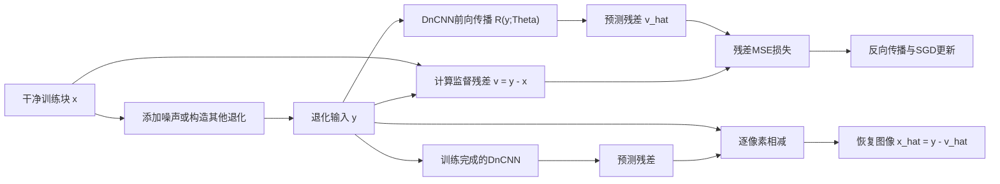

# DnCNN 论文详细分析：基于残差学习的深度卷积神经网络图像去噪

> 论文：Kai Zhang, Wangmeng Zuo, Yunjin Chen, Deyu Meng, and Lei Zhang, **Beyond a Gaussian Denoiser: Residual Learning of Deep CNN for Image Denoising**。  
> 分析对象：[01_DnCNN_Residual_Learning_Deep_CNN_Denoising.pdf](./01_DnCNN_Residual_Learning_Deep_CNN_Denoising.pdf)

## 1. 论文核心结论

DnCNN 将图像去噪从“直接预测干净图像”改写为“预测输入中的退化残差”。对于含噪图像

$$
\mathbf y=\mathbf x+\mathbf v,
$$

网络不直接学习 $\mathcal F(\mathbf y)\approx\mathbf x$，而是学习

$$
\mathcal R(\mathbf y;\Theta)\approx\mathbf v=\mathbf y-\mathbf x,
$$

最后通过

$$
\widehat{\mathbf x}
=
\mathbf y-\mathcal R(\mathbf y;\Theta)
$$

恢复干净图像。

论文的三项关键设计是：

1. **残差学习**：让 CNN 预测噪声或退化残差，而不是直接预测干净图像；
2. **Batch Normalization**：与残差学习结合，加快并稳定深层网络训练；
3. **单模型多退化扩展**：通过改变训练样本的退化类型和强度，使同一网络处理盲高斯去噪、单图像超分辨率和 JPEG 去块效应。

DnCNN 是一个纯卷积、无池化、保持空间分辨率的前馈网络。经典灰度 DnCNN-S 深度为 17 层，盲去噪 DnCNN-B 与多任务 DnCNN-3 深度为 20 层。

---

## 2. 问题定义与符号

| 符号 | 含义 |
|---|---|
| $\mathbf x$ | 潜在干净图像或目标图像 |
| $\mathbf y$ | 输入的退化图像 |
| $\mathbf v$ | 退化残差，定义为 $\mathbf y-\mathbf x$ |
| $\sigma$ | 加性白高斯噪声的标准差 |
| $\mathcal F(\mathbf y)$ | 直接预测干净图像的原始映射 |
| $\mathcal R(\mathbf y;\Theta)$ | DnCNN 学习的残差映射 |
| $\Theta$ | 网络全部可训练参数 |
| $D$ | 网络卷积层总数，即网络深度 |
| $c$ | 图像通道数；灰度图为 1，彩色图为 3 |
| $N$ | 训练样本对数量 |
| $*$ | 二维卷积；在多数深度学习实现中实际计算为互相关 |
| $\|\cdot\|_F$ | Frobenius 范数，即数组所有元素平方和的平方根 |

对标准高斯去噪，论文使用的退化模型为

$$
\mathbf y=\mathbf x+\mathbf v,
\qquad
\mathbf v\sim\mathcal N(\mathbf 0,\sigma^2\mathbf I).
$$

该式表示每个像素的噪声独立同分布、均值为 0、方差为 $\sigma^2$。DnCNN-S 针对固定 $\sigma$ 训练一个模型；DnCNN-B 在多个噪声水平上训练一个盲去噪模型。

---

## 3. 核心原理

### 3.1 从直接映射改为残差映射

直接映射方法学习

$$
\mathcal F(\mathbf y;\Theta)\approx\mathbf x.
$$

DnCNN 学习

$$
\mathcal R(\mathbf y;\Theta)
\approx
\mathbf y-\mathbf x
=
\mathbf v.
$$

两者在表达能力上可以等价，因为

$$
\mathcal F(\mathbf y;\Theta)
=
\mathbf y-\mathcal R(\mathbf y;\Theta).
$$

差别在于优化目标。对于去噪问题，$\mathbf y$ 与 $\mathbf x$ 通常很接近，直接映射 $\mathcal F$ 接近恒等映射。网络需要在多层非线性变换后重新生成与输入高度相似的图像。残差学习则把目标改成噪声或高频退化成分，使网络专注于“输入中应被移除的部分”。

需要区分 DnCNN 与 ResNet：DnCNN 采用的是**全局输出残差学习**，即网络整体输出 $\mathbf v$，最后在网络外执行 $\mathbf y-\widehat{\mathbf v}$。原论文的 DnCNN 主干内部并没有大量 ResNet 式 identity shortcut 残差单元。

### 3.2 隐层逐步分离图像结构与噪声

第 $l$ 层卷积特征可以写为

$$
\mathbf z^{(l)}
=
\mathbf W^{(l)}*\mathbf h^{(l-1)}
+\mathbf b^{(l)},
$$

其中 $\mathbf h^{(0)}=\mathbf y$。卷积核学习局部结构响应，ReLU 和后续卷积不断重组特征。最终层把 64 通道隐藏特征投影回 $c$ 通道残差图：

$$
\widehat{\mathbf v}
=
\mathcal R(\mathbf y;\Theta).
$$

论文将这一过程解释为：隐藏层逐渐去除潜在干净图像的结构成分，使网络输出保留退化残差。

### 3.3 残差学习与 Batch Normalization 的互补性

论文的经验结论是：

- 残差学习使训练目标更容易优化；
- Batch Normalization 缓解训练过程中层输入分布的变化，加快并稳定收敛；
- 残差目标在高斯去噪中近似高斯分布、与图像内容相关性更弱，因此更适合批归一化；
- 仅使用残差学习或仅使用 BN，都不如两者结合。

论文的消融实验同时比较了 RL/BN 的四种组合，并分别使用 SGD 与 Adam。结果显示，决定最佳收敛与去噪性能的主要因素是“残差学习 + BN”的组合，而不是 SGD 或 Adam 中的某一个优化器。

---

## 4. 总体算法流程



训练和推理的本质区别是：训练阶段同时拥有 $\mathbf y$ 与 $\mathbf x$，可计算监督残差并更新参数；推理阶段只有 $\mathbf y$，网络参数固定，只进行一次前向传播和一次残差相减。

---

## 5. 网络架构详细分析

### 5.1 架构总览

深度为 $D$ 的 DnCNN 由三类层组成：

| 位置 | 结构 | 卷积核 | 输出通道 | BN | 激活 |
|---|---|---|---:|---|---|
| 第 1 层 | Conv + ReLU | $3\times3\times c$ | 64 | 否 | ReLU |
| 第 $2$ 至 $D-1$ 层 | Conv + BN + ReLU | $3\times3\times64$ | 64 | 是 | ReLU |
| 第 $D$ 层 | Conv | $3\times3\times64$ | $c$ | 否 | 无 |

其中：

- 灰度图 $c=1$；
- 彩色图 $c=3$；
- 所有卷积步长均为 1；
- 每层卷积前后采用等效的 1 像素零填充，使特征图尺寸不变；
- 不使用池化层或上采样层；
- 隐层宽度固定为 64 个特征通道；
- 最后一层不使用 BN 和 ReLU，因为残差可以包含正值和负值。

### 5.2 第一层：Conv + ReLU

输入为退化图像

$$
\mathbf h^{(0)}=\mathbf y
\in\mathbb R^{H\times W\times c}.
$$

第一层使用 64 个 $3\times3\times c$ 卷积核：

$$
\mathbf z_k^{(1)}
=
\sum_{q=1}^{c}
\mathbf W_{k,q}^{(1)}*\mathbf y_q
+b_k^{(1)},
\qquad k=1,\ldots,64.
$$

逐元素 ReLU 为

$$
\operatorname{ReLU}(a)=\max(0,a),
$$

因此

$$
\mathbf h_k^{(1)}
=
\max\left(0,\mathbf z_k^{(1)}\right).
$$

第一层把原始像素映射到 64 维局部特征空间。不同卷积核可学习边缘、方向、纹理、平坦区域扰动等局部模式。

### 5.3 中间层：Conv + BN + ReLU

对 $l=2,\ldots,D-1$，先卷积：

$$
\mathbf z_k^{(l)}
=
\sum_{q=1}^{64}
\mathbf W_{k,q}^{(l)}*\mathbf h_q^{(l-1)}
+b_k^{(l)},
\qquad k=1,\ldots,64.
$$

#### Batch Normalization 的训练期计算

对一个 mini-batch 中某通道的激活集合 $\mathcal B=\{z_1,\ldots,z_m\}$，计算均值

$$
\mu_{\mathcal B}
=
\frac1m\sum_{j=1}^{m}z_j,
$$

方差

$$
\sigma_{\mathcal B}^2
=
\frac1m\sum_{j=1}^{m}
(z_j-\mu_{\mathcal B})^2,
$$

标准化

$$
\widehat z_j
=
\frac{z_j-\mu_{\mathcal B}}
{\sqrt{\sigma_{\mathcal B}^2+\varepsilon}},
$$

再执行可学习的缩放和平移

$$
\operatorname{BN}(z_j)
=
\gamma\widehat z_j+\beta.
$$

$\gamma$ 和 $\beta$ 是每个特征通道独立学习的参数，$\varepsilon$ 防止方差过小时除零。

在卷积特征图中，$m$ 通常包含当前 mini-batch 内该通道所有样本和空间位置的激活值。不同框架的具体统计维度可能略有实现差异，但核心是每通道归一化。

#### Batch Normalization 的推理期计算

推理时不再使用单张测试图像的即时 batch 统计量，而使用训练期累积的均值与方差：

$$
\operatorname{BN}_{\mathrm{test}}(z)
=
\gamma
\frac{z-\mu_{\mathrm{run}}}
{\sqrt{\sigma_{\mathrm{run}}^2+\varepsilon}}
+\beta.
$$

最后执行 ReLU：

$$
\mathbf h^{(l)}
=
\operatorname{ReLU}
\left(
\operatorname{BN}
\left(
\mathbf z^{(l)}
\right)
\right).
$$

### 5.4 最后一层：线性卷积重建残差

最后一层使用 $c$ 个 $3\times3\times64$ 卷积核：

$$
\widehat{\mathbf v}_k
=
\sum_{q=1}^{64}
\mathbf W_{k,q}^{(D)}*\mathbf h_q^{(D-1)}
+b_k^{(D)},
\qquad k=1,\ldots,c.
$$

最后一层不使用 ReLU，原因是噪声残差 $\mathbf v=\mathbf y-\mathbf x$ 可正可负；若使用 ReLU，会强制输出非负并破坏残差表达。

### 5.5 残差相减得到恢复图像

网络输出为

$$
\widehat{\mathbf v}
=
\mathcal R(\mathbf y;\Theta).
$$

恢复图像为

$$
\widehat{\mathbf x}
=
\mathbf y-\widehat{\mathbf v}
=
\mathbf y-\mathcal R(\mathbf y;\Theta).
$$

对每一个像素和通道，有

$$
\widehat x_{i,j,k}
=
y_{i,j,k}-\widehat v_{i,j,k}.
$$

这一步没有可训练参数，只是确定性的逐元素减法。

### 5.6 感受野与网络深度

所有卷积核大小为 $3\times3$、步长为 1、无池化。第 1 层一个输出位置看到 $3\times3$ 输入区域；每增加一层，感受野边长增加 2。因此深度为 $d$ 时

$$
r_d
=
1+\sum_{l=1}^{d}(3-1)
=
2d+1.
$$

二维感受野为

$$
r_d\times r_d
=
(2d+1)\times(2d+1).
$$

所以：

| 深度 | 感受野 | 论文用途 |
|---:|---:|---|
| $D=17$ | $35\times35$ | 固定噪声水平 DnCNN-S |
| $D=20$ | $41\times41$ | DnCNN-B、CDnCNN-B、DnCNN-3 |

论文通过比较传统方法的“有效图像块大小”来选择深度。在 $\sigma=25$ 时，论文列出 BM3D 为 $49\times49$、WNNM 为 $361\times361$、EPLL 为 $36\times36$、MLP 为 $47\times47$、CSF/TNRD 为 $61\times61$。作者选择 17 层来验证约 $35\times35$ 的感受野是否足以与这些方法竞争。

### 5.7 零填充和输出尺寸

设输入空间尺寸为 $H\times W$，卷积核边长 $k=3$、步长 $s=1$、填充 $p=1$。单维输出尺寸为

$$
H_{\mathrm{out}}
=
\left\lfloor
\frac{H+2p-k}{s}
\right\rfloor+1
=
H.
$$

宽度同理。因此每层特征图与输入保持同样大小，最终可直接执行 $\mathbf y-\widehat{\mathbf v}$。

论文认为逐层零填充没有造成明显边界伪影。需要注意，边界附近的实际感受野包含零值，和图像内部的统计条件不同；现代实现也可考虑反射填充，但这不是原论文配置。

### 5.8 参数量

忽略卷积偏置和 BN 参数时，卷积权重总数为

$$
P_{\mathrm{conv}}
=
(3\times3\times c\times64)
+(D-2)(3\times3\times64\times64)
+(3\times3\times64\times c).
$$

化简为

$$
P_{\mathrm{conv}}
=
1152c+36864(D-2).
$$

典型配置为：

| 配置 | $D$ | $c$ | 卷积权重数，不含偏置和 BN |
|---|---:|---:|---:|
| 灰度 DnCNN-S | 17 | 1 | 554,112 |
| 灰度 DnCNN-B / DnCNN-3 | 20 | 1 | 664,704 |
| 彩色 CDnCNN-B | 20 | 3 | 667,008 |

中间的 $D-2$ 个 BN 层各有 64 个可学习缩放参数 $\gamma$ 和 64 个平移参数 $\beta$，因此

$$
P_{\mathrm{BN}}=128(D-2).
$$

运行均值和运行方差属于推理状态，通常不通过梯度学习，所以一般不计入可训练参数。

---

## 6. 论文公式（1）：残差学习损失

训练数据为 $N$ 对退化图像和干净图像

$$
\left\{
(\mathbf y_i,\mathbf x_i)
\right\}_{i=1}^{N}.
$$

第 $i$ 个真实残差是

$$
\mathbf v_i
=
\mathbf y_i-\mathbf x_i.
$$

DnCNN 的损失函数为

$$
\ell(\Theta)
=
\frac{1}{2N}
\sum_{i=1}^{N}
\left\|
\mathcal R(\mathbf y_i;\Theta)
-(\mathbf y_i-\mathbf x_i)
\right\|_F^2.
\tag{1}
$$

定义预测误差

$$
\mathbf e_i
=
\mathcal R(\mathbf y_i;\Theta)-\mathbf v_i,
$$

则

$$
\ell(\Theta)
=
\frac{1}{2N}
\sum_{i=1}^{N}
\sum_{p}
e_{i,p}^2.
$$

其中 $p$ 遍历图像块中的所有像素和通道。因子 $1/2$ 用于抵消平方项求导产生的 2。损失对网络输出的梯度为

$$
\frac{\partial\ell}
{\partial\mathcal R(\mathbf y_i;\Theta)}
=
\frac1N\mathbf e_i.
$$

再通过链式法则反向传播到参数：

$$
\nabla_{\Theta}\ell
=
\frac1N
\sum_{i=1}^{N}
\left(
\frac{\partial\mathcal R(\mathbf y_i;\Theta)}
{\partial\Theta}
\right)^{\!T}
\mathbf e_i.
$$

最小化残差 MSE 与最小化恢复图像 MSE 是等价的。因为

$$
\widehat{\mathbf x}_i-\mathbf x_i
=
\left(\mathbf y_i-\widehat{\mathbf v}_i\right)-\mathbf x_i
=
\mathbf v_i-\widehat{\mathbf v}_i,
$$

所以

$$
\left\|
\widehat{\mathbf x}_i-\mathbf x_i
\right\|_F^2
=
\left\|
\widehat{\mathbf v}_i-\mathbf v_i
\right\|_F^2.
$$

残差学习改变的是优化参数化和特征学习路径，而不是 MSE 对最终恢复误差的数学度量。

---

## 7. 训练流程详细分析

### 7.1 生成监督训练对

对高斯去噪，从干净图像裁剪训练块 $\mathbf x_i$，生成噪声

$$
\mathbf v_i
\sim
\mathcal N(\mathbf 0,\sigma_i^2\mathbf I),
$$

再合成

$$
\mathbf y_i=\mathbf x_i+\mathbf v_i.
$$

监督标签不是 $\mathbf x_i$，而是

$$
\mathbf t_i
=
\mathbf y_i-\mathbf x_i
=
\mathbf v_i.
$$

不同版本的 $\sigma_i$ 选择方式：

- DnCNN-S：固定为 15、25 或 50，每个噪声水平单独训练模型；
- DnCNN-B：从 $[0,55]$ 范围生成不同噪声水平，训练一个盲高斯去噪模型；
- CDnCNN-B：彩色图像、噪声范围同为 $[0,55]$；
- DnCNN-3：混合高斯噪声、SISR 与 JPEG 退化样本。

### 7.2 数据规模

| 模型 | 训练图像 | 训练块 | 退化设置 |
|---|---|---|---|
| DnCNN-S | 400 张 $180\times180$ 图像 | $128\times1600=204,800$ 个 $40\times40$ 块 | 固定 $\sigma\in\{15,25,50\}$，每个水平独立训练 |
| DnCNN-B | 同上 400 张图像 | $128\times3000=384,000$ 个 $50\times50$ 块 | $\sigma\in[0,55]$ |
| CDnCNN-B | BSD 中剩余 432 张彩色图像 | $128\times3000$ 个 $50\times50$ 彩色块 | $\sigma\in[0,55]$ |
| DnCNN-3 | 91 张图像 + BSD 200 张训练图像 | $128\times8000=1,024,000$ 个 $50\times50$ 块 | 混合盲高斯、SISR、JPEG |

DnCNN-3 训练时还对图像块执行旋转和翻转增强，并以 DnCNN-B 参数作为初始化。

### 7.3 权重初始化

论文采用参考文献 [27] 的 ReLU 权重初始化，即常称的 He initialization。对输入连接数为 $n_{\mathrm{in}}$ 的层，可写为

$$
W_{j}
\sim
\mathcal N
\left(
0,\frac{2}{n_{\mathrm{in}}}
\right).
$$

对 $3\times3$ 卷积且输入通道为 $C_{\mathrm{in}}$，

$$
n_{\mathrm{in}}=3\times3\times C_{\mathrm{in}}.
$$

方差 $2/n_{\mathrm{in}}$ 用于补偿 ReLU 将约一半负激活置零造成的方差损失，使深层网络中的信号尺度更稳定。

### 7.4 Mini-batch 前向传播

对大小为 $B=128$ 的 mini-batch：

1. 输入退化块 $\mathbf y_i$；
2. 按第 5 节公式逐层执行 Conv、BN、ReLU；
3. 最后一层输出 $\widehat{\mathbf v}_i$；
4. 按公式（1）计算 batch 平均残差 MSE。

### 7.5 反向传播

从输出误差

$$
\frac{1}{B}
(\widehat{\mathbf v}_i-\mathbf v_i)
$$

开始，依次通过最后卷积层、ReLU、BN 和各卷积层应用链式法则，求得

$$
\mathbf g_t
=
\nabla_{\Theta}\ell_t.
$$

ReLU 的局部导数为

$$
\frac{d\operatorname{ReLU}(a)}{da}
=
\begin{cases}
1,& a>0,\\
0,& a<0.
\end{cases}
$$

在 $a=0$ 处通常由实现选择一个次梯度，一般取 0。

### 7.6 带动量和权重衰减的 SGD

论文使用：

- SGD；
- momentum $\mu=0.9$；
- weight decay $\lambda_{wd}=10^{-4}$；
- mini-batch size $B=128$；
- 训练 50 个 epoch；
- 学习率从 $10^{-1}$ 指数衰减到 $10^{-4}$。

一种与这些设定一致的 SGD 动量写法为

$$
\widetilde{\mathbf g}_t
=
\nabla_{\Theta}\ell_t
+\lambda_{wd}\Theta_t,
$$

$$
\mathbf m_t
=
\mu\mathbf m_{t-1}
+\widetilde{\mathbf g}_t,
$$

$$
\Theta_{t+1}
=
\Theta_t-\eta_t\mathbf m_t.
$$

其中 $\lambda_{wd}\Theta_t$ 是 $L_2$ 权重衰减项，$\mu$ 让当前更新结合历史梯度方向，$\eta_t$ 是当前学习率。

若用连续的几何插值表达论文报告的指数衰减起止点，可写为

$$
\eta(e)
=
10^{-1}
\left(
\frac{10^{-4}}{10^{-1}}
\right)^{\frac{e-1}{49}},
\qquad e=1,\ldots,50.
$$

该式用于解释“从 $10^{-1}$ 指数衰减到 $10^{-4}$”；论文没有列出每个 epoch 的离散学习率表，具体实现应以原始训练代码为准。

### 7.7 训练完成与推理

训练完成后固定 $\Theta^*$。测试图像只需：

$$
\widehat{\mathbf v}
=
\mathcal R(\mathbf y;\Theta^*),
$$

$$
\widehat{\mathbf x}
=
\mathbf y-\widehat{\mathbf v}.
$$

算法没有块搜索、图模型迭代或测试时优化，因此适合 GPU 并行。

### 7.8 训练与推理伪代码

```text
训练：
输入干净图像集合
for epoch = 1 ... 50:
    从干净图像裁剪 x
    按模型类型生成退化输入 y
    计算监督残差 v = y - x
    v_hat = DnCNN(y; Theta)
    loss = mean(||v_hat - v||^2) / 2
    反向传播得到梯度
    用 momentum=0.9、weight_decay=1e-4 的 SGD 更新 Theta
保存训练参数和 BN 运行统计量

推理：
输入退化图像 y
v_hat = DnCNN(y; Theta*)
x_hat = y - v_hat
输出 x_hat
```

---

## 8. 论文公式（2）至（5）：与 TNRD 的关系

论文不是把 DnCNN 视为毫无先验的黑盒，而是通过一阶段 TNRD 推导说明残差网络与变分图像恢复之间的联系。

### 8.1 TNRD 目标函数：公式（2）

TNRD 试图求解

$$
\min_{\mathbf x}
\Psi(\mathbf y-\mathbf x)
+\lambda
\sum_{k=1}^{K}
\sum_{p=1}^{N}
\rho_k
\left(
(\mathbf f_k*\mathbf x)_p
\right).
\tag{2}
$$

各项含义：

- $\Psi(\mathbf y-\mathbf x)$：数据保真项，要求恢复图像与观测符合退化模型；
- $\mathbf f_k$：第 $k$ 个分析滤波器；
- $(\mathbf f_k*\mathbf x)_p$：滤波响应在位置 $p$ 的值；
- $\rho_k(\cdot)$：与滤波器对应的可调惩罚函数；
- $K$：滤波器数量；
- $N$：图像像素数量；
- $\lambda$：数据项与图像先验项之间的权衡系数。

对高斯去噪，论文设

$$
\Psi(\mathbf z)
=
\frac12\|\mathbf z\|_2^2.
$$

### 8.2 一步梯度下降推理：公式（3）

从初始点 $\mathbf x_0=\mathbf y$ 做一步梯度下降：

$$
\mathbf x_1
=
\mathbf y
-\alpha\lambda
\sum_{k=1}^{K}
\left[
\bar{\mathbf f}_k*
\phi_k
\left(
\mathbf f_k*\mathbf y
\right)
\right]
-\alpha
\left.
\frac{\partial\Psi(\mathbf z)}{\partial\mathbf z}
\right|_{\mathbf z=0}.
\tag{3}
$$

其中：

- $\alpha$ 是梯度下降步长；
- $\bar{\mathbf f}_k$ 是 $\mathbf f_k$ 的伴随滤波器，对二维实卷积可理解为将卷积核旋转 $180^\circ$；
- $\phi_k=\rho'_k$ 是惩罚函数的导数，也称 influence function；
- 因为初始点是 $\mathbf x_0=\mathbf y$，所以数据残差 $\mathbf z=\mathbf y-\mathbf x_0=0$。

先验项的梯度结构是

$$
\bar{\mathbf f}_k
*
\phi_k
(\mathbf f_k*\mathbf y),
$$

即“正向卷积 - 点式非线性 - 伴随卷积”，这已经具有两层前馈 CNN 的形式。

### 8.3 高斯数据项在原点的梯度

当

$$
\Psi(\mathbf z)=\frac12\|\mathbf z\|_2^2,
$$

有

$$
\frac{\partial\Psi(\mathbf z)}{\partial\mathbf z}
=
\mathbf z.
$$

因此

$$
\left.
\frac{\partial\Psi(\mathbf z)}{\partial\mathbf z}
\right|_{\mathbf z=0}
=
\mathbf 0.
$$

公式（3）的最后一项消失。

### 8.4 残差表达：公式（4）

定义一步推理后的估计残差

$$
\mathbf v_1
=
\mathbf y-\mathbf x_1.
$$

代入公式（3）得到

$$
\mathbf v_1
=
\alpha\lambda
\sum_{k=1}^{K}
\left[
\bar{\mathbf f}_k*
\phi_k
\left(
\mathbf f_k*\mathbf y
\right)
\right].
\tag{4}
$$

该式可视为两层 CNN：

1. 第一层用 $\mathbf f_k$ 提取卷积特征；
2. 中间用 $\phi_k$ 执行逐点非线性；
3. 第二层用 $\bar{\mathbf f}_k$ 合成残差；
4. 对所有 $k$ 的响应求和。

DnCNN 对它进行了三点推广：

1. 用易训练的 ReLU 代替手工参数化的 influence function；
2. 从两层扩展到 17 或 20 层，提高图像先验建模能力；
3. 加入 BN，改善深层优化。

因此，DnCNN 的卷积参数可被解释为从数据中学习的图像先验特征，而残差输出对应变分推理中的“应从观测中移除的成分”。

### 8.5 向非高斯与一般退化扩展的条件：公式（5）

论文指出，即使噪声不是高斯分布，只要数据保真项满足

$$
\left.
\frac{\partial\Psi(\mathbf z)}{\partial\mathbf z}
\right|_{\mathbf z=0}
=
\mathbf 0,
\tag{5}
$$

仍可从公式（3）得到类似公式（4）的残差表达。

这意味着：若从输入本身作为推理初始点，数据项在零残差处梯度为零，则第一步变化主要由学习到的图像先验决定。广义高斯噪声的许多对称损失满足这一条件。论文进一步把 SISR 与 JPEG 去块也视作“输入与目标之间存在可预测残差”的恢复问题。

公式（5）是解释多任务扩展的理论动机，而不是严格证明一个网络必然能同时最优处理所有退化。最终能否泛化仍取决于训练数据是否覆盖相应退化分布。

---

## 9. DnCNN 的模型变体

| 模型 | 深度 | 输入/输出 | 训练退化 | 测试时是否需要噪声水平 |
|---|---:|---|---|---|
| DnCNN-S | 17 | 灰度残差 | 固定 $\sigma=15,25,50$，每个水平独立模型 | 需要选择对应模型 |
| DnCNN-B | 20 | 灰度残差 | AWGN，$\sigma\in[0,55]$ | 不需要显式估计 $\sigma$ |
| CDnCNN-B | 20 | 三通道彩色残差 | 彩色 AWGN，$\sigma\in[0,55]$ | 不需要显式估计 $\sigma$ |
| DnCNN-3 | 20 | 灰度退化残差 | 盲高斯 + 多倍率 SISR + 多质量 JPEG | 不显式输入退化参数 |

### 9.1 固定噪声 DnCNN-S

训练时固定

$$
\sigma_i=\sigma_0.
$$

模型学习条件分布中固定噪声水平对应的估计器。其优势是针对性强；缺点是每个 $\sigma$ 需要单独模型，测试时还要知道或估计噪声水平。

### 9.2 盲去噪 DnCNN-B

训练样本覆盖

$$
\sigma_i\in[0,55].
$$

虽然网络没有显式接收 $\sigma_i$，它可从图像局部统计中隐式判断噪声强度，并输出不同幅度的残差。该模型只在训练范围内得到论文验证；当测试噪声远超范围或噪声分布不同，不能保证性能。

### 9.3 彩色盲去噪 CDnCNN-B

输入和输出均为三通道：

$$
\mathbf y,\widehat{\mathbf v},\widehat{\mathbf x}
\in\mathbb R^{H\times W\times3}.
$$

卷积可联合利用 RGB 通道相关性，而不是分别独立去噪。

### 9.4 多任务 DnCNN-3

DnCNN-3 把三类退化都统一为

$$
\mathbf v=\mathbf y-\mathbf x,
\qquad
\widehat{\mathbf x}
=
\mathbf y-\mathcal R(\mathbf y;\Theta).
$$

训练输入包括：

- 高斯去噪：$\mathbf y=\mathbf x+\mathbf n$，$\sigma\in[0,55]$；
- SISR：先以倍率 $2,3,4$ 双三次下采样，再双三次上采样到目标尺寸，将插值结果作为 $\mathbf y$；
- JPEG 去块：以质量因子 $q\in[5,99]$ 压缩并解码，得到 $\mathbf y$。

三类输入与目标尺寸一致，因此可以共用同一个全卷积残差网络。网络根据局部退化模式隐式判断应去除噪声、补偿插值误差还是消除压缩伪影。

---

## 10. 完整推理流程

### 10.1 输入预处理

1. 读取灰度或彩色图像；
2. 将数据范围转换为训练时使用的尺度；
3. 确认通道数与模型一致；
4. DnCNN-S 根据已知 $\sigma$ 选择模型，DnCNN-B 不需要输入噪声图。

如果训练时像素范围为 $[0,255]$ 而实现推理时改用 $[0,1]$，噪声标准差也应缩放：

$$
\sigma_{[0,1]}
=
\frac{\sigma_{[0,255]}}{255}.
$$

### 10.2 单次前向传播

```text
h = y
h = ReLU(Conv_1(h))
for l = 2 ... D-1:
    h = ReLU(BN_l(Conv_l(h)))
v_hat = Conv_D(h)
x_hat = y - v_hat
```

因为网络是全卷积结构，理论上可接受任意空间尺寸；实际最大尺寸受 GPU/CPU 内存限制。

### 10.3 输出后处理

恢复结果可裁剪到合法强度范围：

$$
\widehat{\mathbf x}_{\mathrm{clip}}
=
\min
\left(
I_{\max},
\max(I_{\min},\widehat{\mathbf x})
\right).
$$

裁剪并非论文核心网络层，但实际图像保存时通常需要避免残差相减产生轻微越界值。

---

## 11. 评价指标

### 11.1 均方误差

对包含 $M$ 个像素/通道值的图像，

$$
\operatorname{MSE}
=
\frac1M
\sum_{p=1}^{M}
(x_p-\widehat x_p)^2.
$$

### 11.2 PSNR

$$
\operatorname{PSNR}
=
10\log_{10}
\left(
\frac{I_{\max}^2}{\operatorname{MSE}}
\right).
$$

8-bit 图像中 $I_{\max}=255$；若数据归一化为 $[0,1]$，则 $I_{\max}=1$。PSNR 越大，平均平方误差越小。

### 11.3 SSIM

论文在多任务实验中还报告 SSIM。对局部窗口中的两幅图像 $x$ 与 $\hat x$，标准形式为

$$
\operatorname{SSIM}(x,\widehat x)
=
\frac{
(2\mu_x\mu_{\widehat x}+C_1)
(2\sigma_{x\widehat x}+C_2)
}{
(\mu_x^2+\mu_{\widehat x}^2+C_1)
(\sigma_x^2+\sigma_{\widehat x}^2+C_2)
}.
$$

$\mu$ 表示局部均值，$\sigma^2$ 表示局部方差，$\sigma_{x\widehat x}$ 表示协方差。SSIM 更关注亮度、对比度和局部结构相似性。

---

## 12. 主要实验结果

### 12.1 BSD68 灰度高斯去噪平均 PSNR

| 方法 | $\sigma=15$ | $\sigma=25$ | $\sigma=50$ |
|---|---:|---:|---:|
| BM3D | 31.07 | 28.57 | 25.62 |
| WNNM | 31.37 | 28.83 | 25.87 |
| EPLL | 31.21 | 28.68 | 25.67 |
| MLP | - | 28.96 | 26.03 |
| CSF | 31.24 | 28.74 | - |
| TNRD | 31.42 | 28.92 | 25.97 |
| **DnCNN-S** | **31.73** | **29.23** | **26.23** |
| DnCNN-B | 31.61 | 29.16 | **26.23** |

论文中 DnCNN-S 在三个噪声水平上均比 BM3D 高约 0.6 dB。DnCNN-B 不知道具体噪声水平，却仍超过针对固定噪声训练的多种对比方法，说明单模型盲去噪具有可行性。

### 12.2 运行时间

论文在 $\sigma=25$ 下报告 CPU/GPU 时间。例如：

| 图像尺寸 | DnCNN-S CPU / GPU | DnCNN-B CPU / GPU |
|---:|---:|---:|
| $256\times256$ | 0.74 s / 0.014 s | 0.90 s / 0.016 s |
| $512\times512$ | 3.41 s / 0.051 s | 4.11 s / 0.060 s |
| $1024\times1024$ | 12.1 s / 0.200 s | 14.1 s / 0.235 s |

这些时间来自论文当时的 Matlab/MatConvNet、Intel i7-5820K 与 Nvidia Titan X 环境，不能直接代表现代硬件，但能说明 DnCNN 的卷积结构适合 GPU 并行。

### 12.3 训练时间

在论文硬件上：

- DnCNN-S 约 6 小时；
- DnCNN-B / CDnCNN-B 约 1 天；
- DnCNN-3 约 3 天。

### 12.4 消融实验结论

论文比较了：

- 有残差学习 + 有 BN；
- 有残差学习 + 无 BN；
- 无残差学习 + 有 BN；
- 无残差学习 + 无 BN。

在 SGD 与 Adam 两种优化器下，“有残差学习 + 有 BN”都收敛更快且最终 PSNR 更高。这支持作者的核心判断：性能提升来自残差参数化与 BN 的结合，不只是优化器选择。

---

## 13. 为什么 DnCNN 有效

### 13.1 学习目标更聚焦

输入与目标的大部分低频结构相同，残差主要包含噪声、伪影和需要修正的局部细节。让网络预测残差，相当于把恒等传递交给外部减法路径，把有限网络容量集中到差异建模。

### 13.2 深层感受野提供上下文

17 层网络的每个输出像素可利用 $35\times35$ 邻域；20 层可利用 $41\times41$ 邻域。比浅层滤波器更大的上下文有助于区分真实边缘和随机噪声。

### 13.3 BN 改善深层优化

BN 约束中间激活尺度，减少不同层梯度尺度失衡。残差特征比原始图像特征更接近零均值、内容相关性更弱，使 BN 统计更稳定。

### 13.4 端到端学习替代手工先验与测试时迭代

传统方法需要显式定义稀疏先验、非局部先验、惩罚函数或迭代推理。DnCNN 把从局部观测到残差的映射直接编码在卷积权重中，推理时只做固定前向计算。

### 13.5 全卷积结构高效且尺寸灵活

同一组卷积核在所有位置共享，参数量与输入图像尺寸无关；无全连接层使模型可以处理不同大小的图像，并充分利用 GPU 并行。

---

## 14. 局限性与使用注意事项

1. **合成噪声与真实噪声存在域差异**：论文重点使用独立白高斯噪声。真实相机噪声可能具有信号依赖性、空间相关性、颜色相关性和成像管线伪影。
2. **DnCNN-S 需要已知噪声水平**：噪声估计错误或模型选择错误会降低效果。
3. **DnCNN-B 的盲性有范围限制**：它只在 $\sigma\in[0,55]$ 训练，超出范围或改变噪声类型不保证泛化。
4. **MSE 倾向平均化**：优化像素平方误差通常带来较高 PSNR，但可能把不确定的高频纹理估计得较平滑。
5. **局部感受野有限**：DnCNN 没有 BM3D 式显式非局部搜索，也没有注意力机制；远距离重复纹理只能在有限感受野内利用。
6. **BN 依赖训练统计量**：测试分布与训练分布差异较大时，运行均值和方差可能不再合适。
7. **零填充改变边界统计**：论文未观察到明显伪影，但边界像素实际获得的上下文弱于图像内部。
8. **多任务模型存在容量共享权衡**：DnCNN-3 能处理三种任务，但不同退化共享同一参数，未必在每项任务上都等于单任务专用模型的理论上限。
9. **没有显式不确定性输出**：网络只输出点估计残差，不提供置信区间或多种可能恢复结果。

---

## 15. 实现时容易出错的细节

1. 标签符号必须与重建公式一致。若标签定义为 $\mathbf v=\mathbf y-\mathbf x$，推理必须使用 $\widehat{\mathbf x}=\mathbf y-\widehat{\mathbf v}$。
2. 最后一层不能使用 ReLU，否则无法输出负残差。
3. 第 1 层和最后 1 层不使用 BN；只有第 2 至 $D-1$ 层为 Conv + BN + ReLU。
4. 深度 $D$ 指卷积层总数，不是“中间块”数量。
5. 训练与测试必须使用一致的像素尺度和 BN 推理模式。
6. 灰度和彩色模型的首尾卷积通道数不同，不能直接混用权重。
7. 推理时应加载 BN 的运行均值与运行方差，不能保持训练模式处理单张图像。
8. 使用无填充卷积会让输出尺寸连续缩小，无法直接与输入残差相减；原论文使用零填充维持尺寸。

---

## 16. 总结

DnCNN 的完整计算链可以概括为

$$
\mathbf y
\xrightarrow{\mathrm{Conv+ReLU}}
\mathbf h^{(1)}
\xrightarrow{(D-2)\times(\mathrm{Conv+BN+ReLU})}
\mathbf h^{(D-1)}
\xrightarrow{\mathrm{Conv}}
\widehat{\mathbf v}
\xrightarrow{\mathbf y-\widehat{\mathbf v}}
\widehat{\mathbf x}.
$$

其贡献不只是“使用更深的 CNN”，而是把三个因素组织成统一方案：

1. 用残差目标把去噪转化为噪声预测；
2. 用 BN 使深层残差网络更容易训练；
3. 用统一的 $\mathbf v=\mathbf y-\mathbf x$ 定义把高斯噪声、插值误差和 JPEG 伪影纳入同一网络。

公式（2）至（5）进一步说明，残差 CNN 可以看作从变分图像先验的一步推理结构扩展而来：卷积提取滤波响应，非线性实现影响函数，后续卷积合成应从观测中移除的残差。DnCNN 用更深的网络、ReLU、BN 和端到端数据学习，把这种结构推广为高效的判别式图像恢复模型。

---

## 参考文献

[1] K. Zhang, W. Zuo, Y. Chen, D. Meng, and L. Zhang, “Beyond a Gaussian Denoiser: Residual Learning of Deep CNN for Image Denoising,” *IEEE Transactions on Image Processing*, vol. 26, no. 7, pp. 3142-3155, 2017. DOI: 10.1109/TIP.2017.2662206.  
简要说明：DnCNN 的核心论文，提出残差噪声预测、残差学习与 Batch Normalization 的结合，并扩展到盲高斯去噪、SISR 和 JPEG 去块。

[2] K. He, X. Zhang, S. Ren, and J. Sun, “Deep Residual Learning for Image Recognition,” *CVPR*, 2016.  
简要说明：系统提出深度残差网络。DnCNN 借鉴残差学习思想，但其原始架构主要采用全局残差输出，而不是在主干内部堆叠 ResNet 残差单元。

[3] S. Ioffe and C. Szegedy, “Batch Normalization: Accelerating Deep Network Training by Reducing Internal Covariate Shift,” *ICML*, 2015.  
简要说明：提出 Batch Normalization。DnCNN 将 BN 放在第 2 至 $D-1$ 个卷积层与 ReLU 之间，用于稳定和加速训练。

[4] Y. Chen and T. Pock, “Trainable Nonlinear Reaction Diffusion: A Flexible Framework for Fast and Effective Image Restoration,” *IEEE Transactions on Pattern Analysis and Machine Intelligence*, 2017.  
简要说明：提出可训练非线性反应扩散模型。DnCNN 论文通过 TNRD 的一步梯度推理解释残差 CNN 与显式图像先验之间的联系。

