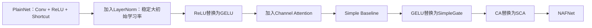

# NAFNet 论文详细分析：Simple Baselines for Image Restoration

> 论文：Liangyu Chen, Xiaojie Chu, Xiangyu Zhang, and Jian Sun, **Simple Baselines for Image Restoration**，ECCV 2022。  
> 分析对象：[12_NAFNet_Simple_Baselines_Image_Restoration.pdf](./12_NAFNet_Simple_Baselines_Image_Restoration.pdf)

## 1. 核心结论

本文的研究问题不是“如何继续堆叠更复杂的模块”，而是：**图像恢复网络达到高性能究竟需要哪些最基本的组成部分？**

作者先从最普通的卷积、ReLU 和残差连接出发构造 PlainNet，然后依次加入：

1. Layer Normalization；
2. 用 GELU 替换 ReLU；
3. Channel Attention。

由此得到一个简单但性能很强的 Baseline。随后作者进一步发现：

- GELU 可以视为门控线性单元 GLU 的特殊情况；
- GLU 即使去掉 Sigmoid 等激活函数，两个线性分支的逐元素乘法仍具有非线性；
- 因此可以用极简的 **SimpleGate** 替代 GELU；
- Channel Attention 也可视为门控结构，并简化为 **Simplified Channel Attention，SCA**。

最终得到 NAFNet（Nonlinear Activation Free Network）。它不使用 ReLU、GELU、Sigmoid、Softmax 等传统非线性激活函数，却在图像去噪和去模糊任务上达到或超过当时的先进方法。

需要准确理解论文标题中的“Nonlinear Activation Free”：

> NAFNet 没有传统的逐元素激活函数，但整个网络并不是线性模型。SimpleGate、SCA、LayerNorm 以及特征相乘都包含输入相关的非线性。

例如，两个线性投影相乘

$$
(\mathbf w_1^T\mathbf x)(\mathbf w_2^T\mathbf x)
=
\mathbf x^T
(\mathbf w_1\mathbf w_2^T)
\mathbf x
$$

是关于 $\mathbf x$ 的二次函数，而不是线性函数。

---

## 2. 任务定义与符号

图像恢复可统一写成

$$
\mathbf y=\mathcal D(\mathbf x)+\mathbf n,
$$

其中：

- $\mathbf x$ 是目标清晰图像；
- $\mathbf y$ 是退化输入；
- $\mathcal D$ 表示模糊、压缩、颜色处理等退化算子；
- $\mathbf n$ 表示噪声；
- 网络学习恢复映射 $\widehat{\mathbf x}=F_\Theta(\mathbf y)$。

| 符号 | 含义 |
|---|---|
| $B$ | batch size |
| $C$ 或 $c$ | 特征通道数、网络宽度 |
| $H,W$ | 特征图高度和宽度 |
| $\mathbf X$ | NAFBlock 的输入特征 |
| $\odot$ | 逐元素乘法 |
| $*$ | 论文公式（5）至（7）中的逐通道乘法；其他上下文可表示卷积 |
| $\operatorname{pool}$ | 全局平均池化或经 TLC 转换后的局部平均池化 |
| $\operatorname{LN}$ | Layer Normalization |
| $\operatorname{Conv}_{1\times1}$ | 逐点卷积，用于通道混合或升降维 |
| $\operatorname{DWConv}_{3\times3}$ | 深度卷积，各通道独立执行空间卷积 |
| $\beta,\gamma$ | 两个残差分支的可学习缩放系数，按 skip-init 初始化为 0 |

---

## 3. 设计路线：从复杂方法回到简单基线

论文把恢复网络复杂度分为两类：

### 3.1 Inter-block complexity

指模块之间的组织复杂度，例如：

- 多阶段网络：后一阶段继续细化前一阶段输出；eg.MPRNET;
优势：逐阶段处理，减少每阶段计算量；劣势：增加训练难度和内存占用
- 多尺度融合：不同空间尺度反复交换特征；eg. MIMO-UNet;
优势：有利于捕获大范围上下文信息；劣势：增加计算量和内存占用
- 单阶段 U-shaped 网络：编码器、瓶颈、解码器和跳跃连接。eg. Restormer、NAFNet;
优势：结构简单、计算量小、易训练；劣势：可能缺少跨尺度信息

NAFNet 选择第三种：**单阶段 U-Net 架构**。这样保留多尺度表示与编码器-解码器跳跃连接，同时避免多阶段堆叠和复杂跨尺度融合。

### 3.2 Intra-block complexity

指一个基本块内部使用的操作，例如多头注意力、门控前馈网络、归一化、卷积、激活和通道注意力。本文的主要创新集中于这一部分：通过消融实验识别必要模块，再尽可能简化。

### 3.3 从 PlainNet 到 Baseline，再到 NAFNet



消融结果表明：

- LN 解决 PlainNet 在 $10^{-3}$ 学习率下的不稳定问题；
- GELU 主要改善去模糊；
- CA 为去噪和去模糊补充全局通道信息；
- SimpleGate 与 SCA 更简单，却没有带来性能损失。

---

## 4. 整体网络架构

### 4.1 单阶段 U-shaped 主干

NAFNet 的全局结构为

```mermaid
flowchart LR
    I["退化图像 y"] --> IN["3x3 Intro Conv"]
    IN --> E1["Encoder Stage 1：NAFBlocks"]
    E1 --> D1["2x2 stride-2 Conv"]
    D1 --> E2["Encoder Stage 2"]
    E2 --> D2["Downsample"]
    D2 --> EN["更低分辨率Encoder Stages"]
    EN --> M["Middle NAFBlocks"]
    M --> U["1x1 Conv + PixelShuffle上采样"]
    U --> A["与对应Encoder特征逐元素相加"]
    A --> DE["Decoder NAFBlocks"]
    DE --> OUT["3x3 Ending Conv"]
    OUT --> R["与输入图像做全局残差相加"]
    R --> O["恢复图像 x_hat"]
```



论文正文明确给出单阶段 U-shaped 结构、默认基础宽度 32 和默认总块数 36，但没有在正文或附录中逐项列出每个 encoder/middle/decoder stage 的块数分配。因此，复现某个具体预训练模型时还应读取论文配套配置文件，不能只凭“36 blocks”自行平均分配。应用实验把网络宽度从 32 扩大到 64；RAW 去噪实验则把宽度缩为 16、块数缩为 7，用于说明模型可以按计算预算缩放。

假设第 $s$ 个编码阶段输入为

$$
\mathbf E_s
\in
\mathbb R^{B\times C_s\times H_s\times W_s}.
$$

经过若干 NAFBlock 后保存跳跃特征

$$
\mathbf S_s
=
\operatorname{NAFStage}_s(\mathbf E_s).
$$

下采样得到

$$
\mathbf E_{s+1}
=
\operatorname{Conv}_{2\times2,\,stride=2}(\mathbf S_s),
$$

其典型空间尺寸变化为

$$
H_{s+1}=\frac{H_s}{2},
\qquad
W_{s+1}=\frac{W_s}{2},
$$

通道数通常加倍：

$$
C_{s+1}=2C_s.
$$

### 4.2 编码器-解码器特征融合

附录说明，NAFNet 不采用拼接后卷积，而直接逐元素相加：

$$
\mathbf D_s^{\mathrm{fuse}}
=
\mathbf D_s^{\mathrm{up}}+\mathbf S_s.
$$

逐元素相加要求两者的空间尺寸和通道数完全相同。与通道拼接相比，它不增加通道宽度，也无需额外融合卷积，因此结构和计算量更小。

### 4.3 下采样

论文附录指定下采样使用 $2\times2$、步长 2 的卷积：

$$
\mathbf E_{s+1}
=
\mathbf W_s^{\mathrm{down}}
*_{stride=2}
\mathbf S_s
+\mathbf b_s^{\mathrm{down}}.
$$

单维输出尺寸为

$$
H_{out}
=
\left\lfloor
\frac{H_{in}+2p-k}{s}
\right\rfloor+1.
$$

取 $k=2,s=2,p=0$ 且尺寸为偶数时，$H_{out}=H_{in}/2$。

### 4.4 上采样

上采样先用 $1\times1$ 卷积增加通道，再使用 PixelShuffle：

$$
\mathbf Q_s
=
\operatorname{Conv}_{1\times1}
(\mathbf D_{s+1}),
$$

$$
\mathbf D_s^{\mathrm{up}}
=
\operatorname{PixelShuffle}_{r=2}(\mathbf Q_s).
$$

PixelShuffle 将

$$
\mathbb R^{B\times(4C)\times H\times W}
\rightarrow
\mathbb R^{B\times C\times2H\times2W}
$$

按确定性的通道重排完成上采样，不需要插值。论文实现中先把当前通道数用逐点卷积扩大 2 倍；结合解码阶段当前通道关系，PixelShuffle 后得到与对应编码器阶段相同的宽度。

### 4.5 输入-输出全局残差

图像恢复输入与输出通常共享大量低频内容。网络预测修正量

$$
\Delta\mathbf y
=
\operatorname{EndingConv}(\mathbf F_{dec}),
$$

最终输出为

$$
\widehat{\mathbf x}
=
\mathbf y+\Delta\mathbf y.
$$

这使网络集中学习噪声、模糊误差和细节补偿，而恒等成分可沿全局残差路径直接传递。

---

## 5. NAFBlock 详细计算流程

NAFBlock 由两个带预归一化的残差子块组成：

1. 空间混合与通道注意力子块；
2. 门控前馈子块。

设输入

$$
\mathbf X
\in
\mathbb R^{B\times C\times H\times W}.
$$

### 5.1 第一次 LayerNorm

NAFNet 使用 LayerNorm 而不是 BatchNorm。对每个 batch、空间位置 $(i,j)$，在通道维计算

$$
\mu_{b,i,j}
=
\frac1C
\sum_{c=1}^{C}
X_{b,c,i,j},
$$

$$
\sigma_{b,i,j}^2
=
\frac1C
\sum_{c=1}^{C}
\left(
X_{b,c,i,j}-\mu_{b,i,j}
\right)^2.
$$

归一化并执行可学习仿射变换：

$$
\operatorname{LN}(X_{b,c,i,j})
=
\alpha_c
\frac{
X_{b,c,i,j}-\mu_{b,i,j}
}{
\sqrt{\sigma_{b,i,j}^2+\varepsilon}
}
+\delta_c.
$$

$\alpha_c$ 和 $\delta_c$ 分别是通道缩放和平移参数。与 BatchNorm 不同，LayerNorm 不依赖 batch 内其他样本的统计量，因此适合高分辨率恢复任务常见的小 batch 训练。

令

$$
\mathbf X_n=\operatorname{LN}_1(\mathbf X).
$$

### 5.2 第一个 $1\times1$ 卷积：通道扩展

逐点卷积只在通道维做线性混合：

$$
P_{b,o,i,j}
=
\sum_{c=1}^{C}
W^{(1)}_{o,c}X_{n,b,c,i,j}
+b^{(1)}_o.
$$

NAFBlock 使用 inverted bottleneck，把通道从 $C$ 扩大到约 $2C$：

$$
\mathbf P
=
\operatorname{Conv}_{1\times1}^{C\rightarrow2C}
(\mathbf X_n).
$$

### 5.3 $3\times3$ Depthwise Convolution：空间混合

深度卷积对每个通道单独使用一个空间卷积核：

$$
Q_{b,c,i,j}
=
\sum_{u=-1}^{1}
\sum_{v=-1}^{1}
K_{c,u,v}
P_{b,c,i+u,j+v}
+b_c.
$$

记为

$$
\mathbf Q
=
\operatorname{DWConv}_{3\times3}(\mathbf P).
$$

普通卷积会同时混合空间和通道，计算量约为 $9HWC_{in}C_{out}$；深度卷积只做逐通道空间混合，计算量约为 $9HWC$。通道混合已经由前后的 $1\times1$ 卷积完成，因此这种分解更高效。

### 5.4 SimpleGate

将 $2C$ 通道均分为两组：

$$
[\mathbf Q_1,\mathbf Q_2]
=
\operatorname{Split}(\mathbf Q),
$$

$$
\mathbf Q_1,\mathbf Q_2
\in
\mathbb R^{B\times C\times H\times W}.
$$

执行逐元素乘法：

$$
\mathbf G
=
\operatorname{SimpleGate}(\mathbf Q)
=
\mathbf Q_1\odot\mathbf Q_2.
$$

对单个位置和通道：

$$
G_{b,c,i,j}
=
Q_{1,b,c,i,j}
Q_{2,b,c,i,j}.
$$

SimpleGate 把通道数由 $2C$ 降回 $C$，同时通过乘法引入二阶交互。它没有 Sigmoid 或 GELU，但不是线性运算。

### 5.5 Simplified Channel Attention

先做空间全局平均池化：

$$
p_{b,c}
=
\frac1{HW}
\sum_{i=1}^{H}
\sum_{j=1}^{W}
G_{b,c,i,j}.
$$

写成张量形式：

$$
\mathbf p
=
\operatorname{pool}(\mathbf G)
\in
\mathbb R^{B\times C\times1\times1}.
$$

用 $1\times1$ 卷积在通道间做线性交互：

$$
\mathbf a
=
\mathbf W_{sca}\mathbf p+\mathbf b_{sca}.
$$

将通道权重广播到所有空间位置并相乘：

$$
\mathbf A
=
\mathbf G\odot\mathbf a.
$$

注意 $\mathbf a$ 没有经过 Sigmoid，因此不被限制在 $[0,1]$。它既可以衰减、增强，也可以翻转某个通道的符号。

### 5.6 第三个 $1\times1$ 卷积：通道投影

$$
\mathbf R_1
=
\operatorname{Conv}_{1\times1}^{C\rightarrow C}
(\mathbf A).
$$

逐点表达为

$$
R_{1,b,o,i,j}
=
\sum_{c=1}^{C}
W^{(3)}_{o,c}A_{b,c,i,j}
+b^{(3)}_o.
$$

### 5.7 第一个残差连接与 skip-init

第一子块输出为

$$
\mathbf Y
=
\mathbf X
+\beta\odot\mathbf R_1.
$$

$\beta\in\mathbb R^{1\times C\times1\times1}$ 是逐通道可学习缩放参数，初始化为 0：

$$
\beta^{(0)}=0.
$$

因此训练开始时

$$
\mathbf Y\approx\mathbf X,
$$

整个子块初始接近恒等映射，随后由优化器逐渐放大有效的残差分支。这就是 skip-init 稳定深层残差训练的核心。

### 5.8 第二次 LayerNorm

$$
\mathbf Y_n
=
\operatorname{LN}_2(\mathbf Y).
$$

计算方式与第 5.1 节相同，但具有独立的归一化参数。

### 5.9 门控前馈分支

先用 $1\times1$ 卷积把通道扩大到 $2C$：

$$
\mathbf U
=
\operatorname{Conv}_{1\times1}^{C\rightarrow2C}
(\mathbf Y_n).
$$

沿通道均分并使用 SimpleGate：

$$
[\mathbf U_1,\mathbf U_2]
=
\operatorname{Split}(\mathbf U),
$$

$$
\mathbf V
=
\mathbf U_1\odot\mathbf U_2.
$$

再投影回 $C$ 通道：

$$
\mathbf R_2
=
\operatorname{Conv}_{1\times1}^{C\rightarrow C}
(\mathbf V).
$$

### 5.10 第二个残差连接

$$
\mathbf Z
=
\mathbf Y
+\gamma\odot\mathbf R_2,
$$

其中

$$
\gamma^{(0)}=0.
$$

$\mathbf Z$ 即 NAFBlock 输出。

### 5.11 NAFBlock 汇总公式

把全部操作合并，可写成

$$
\begin{aligned}
\mathbf P
&= 
\operatorname{Conv}_{1\times1}
(\operatorname{LN}_1(\mathbf X)),\\
\mathbf Q
&=
\operatorname{DWConv}_{3\times3}(\mathbf P),\\
\mathbf G
&=
\operatorname{SG}(\mathbf Q),\\
\mathbf A
&=
\mathbf G\odot
\operatorname{Conv}_{1\times1}
(\operatorname{pool}(\mathbf G)),\\
\mathbf Y
&=
\mathbf X+\beta\odot
\operatorname{Conv}_{1\times1}(\mathbf A),\\
\mathbf U
&=
\operatorname{Conv}_{1\times1}
(\operatorname{LN}_2(\mathbf Y)),\\
\mathbf V
&=
\operatorname{SG}(\mathbf U),\\
\mathbf Z
&=
\mathbf Y+\gamma\odot
\operatorname{Conv}_{1\times1}(\mathbf V).
\end{aligned}
$$

---

## 6. 论文主文公式（1）：Gated Linear Unit

论文将一般门控单元写为

$$
\operatorname{Gate}
(\mathbf X,f,g,\sigma)
=
f(\mathbf X)
\odot
\sigma(g(\mathbf X)).
\tag{1}
$$

其中：

- $f$ 和 $g$ 为线性变换；
- $\sigma$ 为 Sigmoid 等非线性激活函数；
- $f(\mathbf X)$ 是内容分支；
- $\sigma(g(\mathbf X))$ 是门控分支；
- 两者逐元素相乘。

传统门控的每个元素可写成

$$
Y_i
=
f_i(\mathbf X)
\sigma(g_i(\mathbf X)).
$$

当门值接近 0 时抑制内容，接近 1 时保留内容。

论文的关键观察是：即使令 $\sigma$ 为恒等映射，

$$
\operatorname{Gate}(\mathbf X)
=
f(\mathbf X)\odot g(\mathbf X),
$$

两个线性函数的乘积仍然产生非线性，因此额外激活函数可能不是必要的。

---

## 7. 论文主文公式（2）和（3）：GELU

### 7.1 GELU 的定义：公式（2）

$$
\operatorname{GELU}(x)
=
x\Phi(x),
\tag{2}
$$

$\Phi(x)$ 是标准正态分布的累积分布函数：

$$
\Phi(x)
=
\frac{1}{\sqrt{2\pi}}
\int_{-\infty}^{x}
e^{-t^2/2}\,dt.
$$

与 ReLU 的硬阈值不同，GELU 用输入 $x$ 乘一个平滑的、输入相关的门值 $\Phi(x)$。

### 7.2 GELU 的近似实现：公式（3）

论文给出常用近似

$$
\operatorname{GELU}(x)
\approx
0.5x
\left(
1+	anh
\left[
\sqrt{\frac2\pi}
\left(
x+0.044715x^3
\right)
\right]
\right).
\tag{3}
$$

该式包含乘法、三次项、双曲正切等运算。把

$$
f(x)=x,
\qquad
g(x)=x,
\qquad
\sigma=\Phi
$$

代入公式（1），即可得到 GELU。因此作者把 GELU 看作 GLU 的特殊情形，并进一步尝试用更简单的乘法门控替换它。

---

## 8. 论文主文公式（4）：SimpleGate

论文将 SimpleGate 写为

$$
\operatorname{SimpleGate}
(\mathbf X,\mathbf Y)
=
\mathbf X\odot\mathbf Y,
\tag{4}
$$

其中 $\mathbf X$ 和 $\mathbf Y$ 尺寸完全相同。

在 NAFBlock 中，这两个输入并不是两条额外卷积分支，而是同一张 $2C$ 通道特征图的两半：

$$
[\mathbf X,\mathbf Y]
=
\operatorname{Split}
(\mathbf T,\text{channel}).
$$

因此 SG 几乎只需要一次逐元素乘法，并把通道数由 $2C$ 压缩为 $C$。

### 8.1 SimpleGate 的非线性来源

假设单个位置的两组特征来自线性投影：

$$
u=\mathbf a^T\mathbf x,
\qquad
v=\mathbf b^T\mathbf x.
$$

则

$$
uv
=
(\mathbf a^T\mathbf x)
(\mathbf b^T\mathbf x)
=
\sum_i\sum_j
a_i b_j x_i x_j.
$$

输出包含 $x_ix_j$ 二阶交互项，所以整个模块具有比纯线性卷积更强的表达能力。

### 8.2 为什么不需要额外 $\sigma$

论文比较

$$
\mathbf X\odot\sigma(\mathbf Y)
$$

中的 $\sigma$ 取 Identity、ReLU、GELU、Sigmoid、SiLU。SIDD 上变化很小，但 GoPro 上加入这些激活反而下降 0.11 至 0.35 dB，因此作者选择恒等映射。

---

## 9. 论文主文公式（5）：传统 Channel Attention

传统通道注意力写为

$$
\operatorname{CA}(\mathbf X)
=
\mathbf X*
\sigma
\left(
\mathbf W_2
\max
\left(
0,
\mathbf W_1
\operatorname{pool}(\mathbf X)
\right)
\right).
\tag{5}
$$

逐步拆解：

### 9.1 全局平均池化

$$
p_c
=
\frac1{HW}
\sum_{i=1}^{H}
\sum_{j=1}^{W}
X_{c,i,j}.
$$

空间维被压缩，得到每个通道的全局描述。

### 9.2 第一个全连接层或 $1\times1$ 卷积

$$
\mathbf h
=
\mathbf W_1\mathbf p.
$$

通常先把通道从 $C$ 降到 $C/r$。

### 9.3 ReLU

$$
\mathbf h_+
=
\max(0,\mathbf h).
$$

### 9.4 第二个全连接层

$$
\mathbf s
=
\mathbf W_2\mathbf h_+,
$$

把通道恢复到 $C$。

### 9.5 Sigmoid 和通道缩放

$$
\mathbf a
=
\sigma(\mathbf s),
\qquad
a_c\in(0,1),
$$

$$
Y_{c,i,j}
=
X_{c,i,j}a_c.
$$

CA 把全局空间信息汇总成通道权重，但包含两个通道投影、ReLU 和 Sigmoid。

---

## 10. 论文主文公式（6）：把 CA 写成门控

将注意力权重计算整体记为 $\Psi(\mathbf X)$：

$$
\Psi(\mathbf X)
=
\sigma
\left(
\mathbf W_2
\max
\left(
0,
\mathbf W_1
\operatorname{pool}(\mathbf X)
\right)
\right).
$$

于是

$$
\operatorname{CA}(\mathbf X)
=
\mathbf X*\Psi(\mathbf X).
\tag{6}
$$

该形式与公式（1）非常接近：$\mathbf X$ 是内容分支，$\Psi(\mathbf X)$ 是门控分支。因此作者认为 CA 也可采用与 GLU 相同的简化原则。

---

## 11. 论文主文公式（7）：Simplified Channel Attention

保留 CA 的两个核心功能：

1. 聚合全局空间信息；
2. 在通道之间交换信息。

删除降维、ReLU、升维和 Sigmoid，得到

$$
\operatorname{SCA}(\mathbf X)
=
\mathbf X*
\mathbf W
\operatorname{pool}(\mathbf X).
\tag{7}
$$

展开为

$$
p_c
=
\frac1{HW}
\sum_{i,j}X_{c,i,j},
$$

$$
a_o
=
\sum_{c=1}^{C}
W_{o,c}p_c+b_o,
$$

$$
Y_{o,i,j}
=
X_{o,i,j}a_o.
$$

与传统 CA 相比：

- 只需要一次 $C\rightarrow C$ 线性通道变换；
- 没有 ReLU；
- 没有 Sigmoid；
- 权重不限制为正值或小于 1；
- 仍然拥有全局空间汇总和通道交互。

论文实验中，用 SCA 替换 CA 后，SIDD 提升 0.03 dB，GoPro 提升 0.09 dB。

---

## 12. 附录复杂度公式（1）至（4）

附录重新从计算量角度比较 Baseline Block 和 NAFBlock。这里为避免与主文编号混淆，记为公式（A1）至（A4）。

设特征尺寸为 $H\times W\times c$，深度卷积核大小为 $k\times k$，实验中 $k=3$。

### 12.1 Baseline 第一残差分支：公式（A1）

$$
H W c^2
+H W c k^2
+H W c^2.
\tag{A1}
$$

三项分别对应：

1. $1\times1$ 通道混合卷积 $c\rightarrow c$；
2. $k\times k$ 深度卷积；
3. $1\times1$ 投影 $c\rightarrow c$。

因为通常 $c\gg k^2$，所以

$$
H W c k^2
\ll
H W c^2,
$$

从而

$$
\operatorname{MAC}_{base,1}
\approx
2HWc^2.
$$

### 12.2 Baseline 第二残差分支：公式（A2）

第二分支把隐藏通道扩大为 $2c$：

$$
H W c(2c)
+H W(2c)c.
\tag{A2}
$$

即

$$
\operatorname{MAC}_{base,2}
=
4HWc^2.
$$

因此一个 Baseline Block 总计算量近似为

$$
\operatorname{MAC}_{base}
\approx
6HWc^2.
$$

### 12.3 NAFBlock 第一残差分支：公式（A3）

SimpleGate 会把 $2c$ 通道减半，因此前面先扩大到 $2c$：

$$
H W c(2c)
+H W(2c)k^2
+H W c^2.
\tag{A3}
$$

三项分别对应：

1. $1\times1$ 卷积 $c\rightarrow2c$；
2. 在 $2c$ 通道上执行深度卷积；
3. SimpleGate 降到 $c$ 后执行 $1\times1$ 卷积 $c\rightarrow c$。

忽略较小的深度卷积项：

$$
\operatorname{MAC}_{naf,1}
\approx
3HWc^2.
$$

### 12.4 NAFBlock 第二残差分支：公式（A4）

$$
H W c(2c)
+H W c^2.
\tag{A4}
$$

第一个卷积从 $c$ 扩展到 $2c$，SimpleGate 降回 $c$，第二个卷积从 $c$ 投影到 $c$，所以

$$
\operatorname{MAC}_{naf,2}
\approx
3HWc^2.
$$

一个 NAFBlock 总计

$$
\operatorname{MAC}_{naf}
\approx
6HWc^2,
$$

与 Baseline Block 基本一致。因此两者可使用相同的块数、学习率等超参数，进行较公平的消融比较。

### 12.5 CA 与 SCA 的复杂度

传统 CA 以比例 $r$ 降维再升维，通道变换成本为

$$
\frac{c^2}{r}+\frac{c^2}{r}
=
\frac{2c^2}{r}.
$$

SCA 的单个 $c\rightarrow c$ 变换成本为

$$
c^2.
$$

论文在对比实验中取 $r=2$，于是

$$
\frac{2c^2}{2}=c^2,
$$

两者通道投影计算量相等，可排除单纯计算预算差异的干扰。

---

## 13. 训练流程

### 13.1 训练样本

对每一对退化图像和目标图像

$$
(\mathbf y_i,\mathbf x_i),
$$

随机裁剪成相同位置的训练块。消融实验使用 $256\times256$ patch，batch size 为 32。

应用实验将网络宽度从 32 扩大到 64，batch size 改为 64，总迭代数改为 400K，并使用随机裁剪增强。GoPro 去模糊还使用翻转和旋转增强。

### 13.2 PSNR Loss

论文沿用相关恢复方法的 PSNR loss。先定义

$$
\operatorname{MSE}_i
=
\frac1M
\left\|
F_\Theta(\mathbf y_i)-\mathbf x_i
\right\|_2^2,
$$

$M$ 为图像块的像素和通道总数。若像素峰值为 $L$，

$$
\operatorname{PSNR}_i
=
10\log_{10}
\left(
\frac{L^2}{\operatorname{MSE}_i}
\right).
$$

最小化负 PSNR 可写为

$$
\mathcal L_{PSNR}
=
-\frac1B
\sum_{i=1}^{B}
\operatorname{PSNR}_i.
$$

去掉与参数无关的常数 $-10\log_{10}L^2$ 后，等价形式为

$$
\mathcal L_{PSNR}
=
\frac{10}{B}
\sum_{i=1}^{B}
\log_{10}
(\operatorname{MSE}_i+\varepsilon).
$$

它与普通 MSE 的最优点相同，但梯度尺度不同：

$$
\frac{\partial\mathcal L_{PSNR}}
{\partial\operatorname{MSE}}
=
\frac{10}{\ln 10}
\frac1{\operatorname{MSE}+\varepsilon}.
$$

误差较小时，PSNR loss 会相对强调进一步降低误差。

### 13.3 Adam 优化器

消融实验使用 Adam：

$$
\mathbf g_t
=
\nabla_\Theta
\mathcal L_t,
$$

$$
\mathbf m_t
=
\beta_1\mathbf m_{t-1}
+(1-\beta_1)\mathbf g_t,
$$

$$
\mathbf v_t
=
\beta_2\mathbf v_{t-1}
+(1-\beta_2)\mathbf g_t^2,
$$

$$
\widehat{\mathbf m}_t
=
\frac{\mathbf m_t}{1-\beta_1^t},
\qquad
\widehat{\mathbf v}_t
=
\frac{\mathbf v_t}{1-\beta_2^t},
$$

$$
\Theta_{t+1}
=
\Theta_t
-\eta_t
\frac{
\widehat{\mathbf m}_t
}{
\sqrt{\widehat{\mathbf v}_t}+\varepsilon
}.
$$

论文设定为

$$
\beta_1=0.9,
\qquad
\beta_2=0.9,
\qquad
\text{weight decay}=0.
$$

注意这里的 $\beta_1,\beta_2$ 是 Adam 动量参数，与 NAFBlock 残差缩放参数 $\beta$ 不是同一个概念。

### 13.4 Cosine Annealing 学习率

消融实验训练 200K 次迭代，学习率从

$$
\eta_{max}=10^{-3}
$$

余弦退火到

$$
\eta_{min}=10^{-6}.
$$

第 $t$ 次迭代的学习率可写为

$$
\eta_t
=
\eta_{min}
+\frac12
(\eta_{max}-\eta_{min})
\left[
1+\cos
\left(
\frac{\pi t}{T}
\right)
\right],
$$

其中 $T=200000$。应用实验通常训练 400K 次，相应地令 $T=400000$。

### 13.5 梯度裁剪

论文沿用 HINet 的梯度裁剪设置。对梯度向量 $\mathbf g$，常见的全局范数裁剪为

$$
\mathbf g_{clip}
=
\mathbf g
\min
\left(
1,
\frac{\tau}{\|\mathbf g\|_2+\varepsilon}
\right).
$$

当梯度范数超过阈值 $\tau$ 时按比例缩小，防止训练瞬时发散。论文正文未给出 $\tau$ 的具体数值，应以配套训练配置为准。

### 13.6 TLC：缓解训练 patch 与整图测试不一致

SCA 含有全局平均池化。训练时输入为 $256\times256$ patch，若测试时直接对整张高分辨率图像全局池化，统计范围会发生显著变化。

普通全局池化为

$$
p_c
=
\frac1{HW}
\sum_{i=1}^{H}
\sum_{j=1}^{W}
X_{c,i,j}.
$$

TLC（Test-time Local Converter）在测试时将其转换为局部窗口统计：

$$
p_{c,i,j}^{local}
=
\frac1{|\Omega_{i,j}|}
\sum_{(u,v)\in\Omega_{i,j}}
X_{c,u,v},
$$

其中 $\Omega_{i,j}$ 的尺度与训练 patch 所见范围相关。这样每个位置使用局部通道描述，减少训练-测试统计不一致，也避免分块测试产生的接缝伪影。论文在 GoPro 上从 33.08 dB 提高到 33.69 dB。

### 13.7 完整训练伪代码

```text
输入：退化/清晰图像对
初始化：NAFNet 参数；两个残差缩放 beta、gamma 初始化为 0

for t = 1 ... T:
    1. 随机裁剪匹配的输入块 y 和目标块 x
    2. 执行随机翻转/旋转等任务相关增强
    3. 前向传播：x_hat = NAFNet(y)
    4. 计算 PSNR loss
    5. 反向传播得到梯度
    6. 执行梯度裁剪
    7. 使用 Adam 更新参数
    8. 按 cosine annealing 更新学习率

输出：训练好的参数 Theta
```

---

## 14. 推理流程

```text
输入退化图像 y
1. 必要时将尺寸填充为U-Net多次下采样可整除的大小
2. 3x3卷积映射到基础特征宽度
3. 编码器逐级执行NAFBlock并保存skip特征
4. 2x2 stride-2卷积逐级下采样
5. 在最低分辨率执行Middle NAFBlocks
6. 1x1卷积 + PixelShuffle逐级上采样
7. 与同尺度encoder特征逐元素相加
8. decoder NAFBlocks细化
9. 3x3卷积生成图像残差
10. 与原输入相加得到恢复图像
11. 裁掉步骤1引入的边界填充
输出 x_hat
```

一次 NAFBlock 的前向伪代码：

```text
x = input
r = LayerNorm(x)
r = Conv1x1_C_to_2C(r)
r = DepthwiseConv3x3(r)
r = split(r)[0] * split(r)[1]             # SimpleGate
r = r * Conv1x1(GlobalOrLocalPool(r))     # SCA
r = Conv1x1_C_to_C(r)
y = x + beta * r

r = LayerNorm(y)
r = Conv1x1_C_to_2C(r)
r = split(r)[0] * split(r)[1]             # SimpleGate
r = Conv1x1_C_to_C(r)
output = y + gamma * r
```

---

## 15. 消融实验

### 15.1 PlainNet 到 Baseline

| 设置 | SIDD PSNR / SSIM | GoPro PSNR / SSIM | 结论 |
|---|---|---|---|
| PlainNet，lr=$10^{-4}$ | 39.29 / 0.956 | 28.51 / 0.907 | 低学习率可训练，但性能有限 |
| PlainNet，lr=$10^{-3}$ | 不稳定 | 不稳定 | 深层 PlainNet 难以直接使用大初始学习率 |
| + LayerNorm | 39.73 / 0.959 | 31.90 / 0.952 | 显著稳定训练，尤其改善去模糊 |
| ReLU $\rightarrow$ GELU | 39.71 / 0.958 | 32.11 / 0.954 | 去噪近似不变，去模糊提升 |
| + Channel Attention | 39.85 / 0.959 | 32.35 / 0.956 | 全局通道信息有效 |

### 15.2 Baseline 到 NAFNet

| 替换 | SIDD PSNR / SSIM | GoPro PSNR / SSIM | 相对速度 |
|---|---|---|---:|
| Baseline | 39.85 / 0.959 | 32.35 / 0.956 | $1.00\times$ |
| GELU $\rightarrow$ SG | 39.93 / 0.960 | 32.76 / 0.960 | $0.98\times$ |
| CA $\rightarrow$ SCA | 39.95 / 0.960 | 32.54 / 0.958 | $1.11\times$ |
| SG + SCA，即 NAFNet | 39.96 / 0.960 | 32.85 / 0.960 | $1.09\times$ |

这说明简化不是以牺牲性能换取速度；在论文实验中，两个替换反而提升了 PSNR。

### 15.3 块数

| NAFBlock 数量 | SIDD PSNR | GoPro PSNR | 256 延迟 | $720\times1280$ 延迟 |
|---:|---:|---:|---:|---:|
| 9 | 39.78 | 31.79 | 11.8 ms | 154.7 ms |
| 18 | 39.90 | 32.64 | 19.9 ms | 151.7 ms |
| 36 | 39.96 | 32.85 | 39.1 ms | 177.1 ms |
| 72 | 39.95 | 32.88 | 73.8 ms | 230.1 ms |

36 个块在性能和延迟之间更均衡，因此作为默认消融配置。表中不同块数会调整宽度以保持接近的计算预算，所以延迟不必严格随块数单调变化。

---

## 16. 主要实验结果

### 16.1 SIDD RGB 图像去噪

| 方法 | PSNR | SSIM | MACs (G) |
|---|---:|---:|---:|
| Restormer | 40.02 | 0.960 | 140 |
| Baseline | 40.30 | 0.962 | 84 |
| **NAFNet** | **40.30** | **0.962** | **65** |

NAFNet 比当时对比的 Restormer 高 0.28 dB，同时计算量不到其一半。

### 16.2 GoPro 图像去模糊

| 方法 | PSNR | SSIM | MACs (G) |
|---|---:|---:|---:|
| MPRNet-local | 33.31 | 0.964 | 778.2 |
| Baseline | 33.40 | 0.965 | 84 |
| **NAFNet** | **33.69** | **0.967** | **65** |

论文强调 NAFNet 在大幅降低计算量的同时提高 PSNR，说明复杂多阶段或 Transformer 模块不是获得高恢复性能的唯一途径。

### 16.3 RAW 图像去噪

在 4Scenes 数据集：

| 方法 | PSNR | SSIM | MACs (G) |
|---|---:|---:|---:|
| PMRID | 39.76 | 0.975 | 1.2 |
| NAFNet | 40.05 | 0.977 | 1.1 |

作者将宽度从 32 缩到 16、块数从 36 缩到 7，仍超过专门方法，说明网络可灵活缩放。

### 16.4 带 JPEG 伪影的去模糊

在 REDS-val-300：

| 方法 | PSNR | SSIM | MACs (G) |
|---|---:|---:|---:|
| HINet | 28.83 | 0.862 | 170.7 |
| MAXIM | 28.93 | 0.865 | 169.5 |
| NAFNet | 29.09 | 0.867 | 65 |

---

## 17. 为什么 NAFNet 有效

### 17.1 乘法门控提供低成本高阶交互

卷积本身是线性局部变换，SimpleGate 的逐元素乘法允许不同特征分支相互调制，形成二阶特征。它比 GELU 的复杂标量函数更直接，并天然兼具门控和通道压缩功能。

### 17.2 深度卷积负责空间混合，逐点卷积负责通道混合

把普通卷积分解为 $1\times1$ 通道投影和 $3\times3$ 深度空间卷积，能以较低计算量覆盖两种信息交互。

### 17.3 SCA 用最少操作引入全局信息

全局或局部平均池化提供空间上下文，单个 $1\times1$ 卷积实现通道交互，再与原特征相乘。它避免自注意力的空间二次复杂度。

### 17.4 LayerNorm 与 skip-init 稳定深层训练

LayerNorm 不依赖 batch 统计，适合小 batch；零初始化残差缩放使每个块从恒等映射开始，降低深层残差叠加导致的优化风险。

### 17.5 简单 U-Net 提供多尺度上下文

编码器降低空间分辨率、扩大有效感受野；解码器逐步恢复分辨率；跳跃连接补回高分辨率细节。NAFBlock 因而不需要复杂全局自注意力也能利用大范围上下文。

---

## 18. 局限性与注意事项

1. **“无激活”不是线性网络**：SimpleGate、SCA 和 LayerNorm 都是输入相关非线性。名称仅表示移除了传统激活函数。
2. **SCA 的全局池化存在训练-测试尺度差异**：论文通过 TLC 缓解；如果实现遗漏 TLC，整图测试结果可能下降。
3. **乘法门控可能放大数值尺度**：LayerNorm、残差缩放和良好初始化对稳定性很重要。
4. **全局平均丢失空间分布**：SCA 只输出每通道一个权重，不能像空间注意力那样表示不同位置的远距离对应关系。
5. **去噪模型主要针对监督数据分布**：SIDD 或 RAW 训练数据与新的相机、噪声管线差异大时可能产生域偏移。
6. **PSNR loss 偏向像素保真**：它有利于 PSNR，但对高度不确定的纹理可能产生平均化结果。
7. **U-Net 尺寸约束**：多次步长 2 下采样要求输入尺寸可被相应 $2^L$ 整除，实际实现通常需要边界填充并在输出时裁剪。
8. **论文性能依赖训练协议**：大 patch、随机增强、TLC、skip-init、余弦退火、训练迭代数都会影响最终结果，不能只复现 NAFBlock 而忽略训练设置。

---

## 19. 实现时容易出错的细节

1. SimpleGate 输入通道数必须为偶数，并沿通道维等分。
2. 第一残差分支中，$C\rightarrow2C$ 后经过 SG 变回 $C$；最后投影卷积的输入通道应为 $C$。
3. 第二残差分支同样先扩展到 $2C$，SG 后再投影回 $C$。
4. SCA 的池化结果应保持 $B\times C\times1\times1$，再广播到 $H\times W$。
5. SCA 权重后面不要错误加入 Sigmoid；原始 NAFNet 没有这一激活。
6. LayerNorm 是预归一化，位于每个残差分支的开头。
7. $\beta$ 和 $\gamma$ 应初始化为 0；若随机初始化，训练初期不再接近恒等映射。
8. 编码器与解码器特征采用逐元素相加，不是通道拼接。
9. 下采样是 $2\times2$ stride-2 卷积，上采样是 $1\times1$ 卷积加 PixelShuffle。
10. 推理整图时应处理 TLC 或与训练 patch 尺度相容的局部池化策略。

---

## 20. 总结

NAFNet 的核心计算链为

$$
\operatorname{LN}
\rightarrow
1\times1\operatorname{Conv}
\rightarrow
3\times3\operatorname{DWConv}
\rightarrow
\operatorname{SimpleGate}
\rightarrow
\operatorname{SCA}
\rightarrow
1\times1\operatorname{Conv}
\rightarrow
\operatorname{ResidualAdd},
$$

随后再执行

$$
\operatorname{LN}
\rightarrow
1\times1\operatorname{Conv}
\rightarrow
\operatorname{SimpleGate}
\rightarrow
1\times1\operatorname{Conv}
\rightarrow
\operatorname{ResidualAdd}.
$$

整网则把 NAFBlock 放入单阶段 U-Net：

$$
\text{输入卷积}
\rightarrow
\text{多尺度编码器}
\rightarrow
\text{瓶颈块}
\rightarrow
\text{多尺度解码器}
\rightarrow
\text{输出卷积}
\rightarrow
\text{全局残差相加}.
$$

论文最重要的启示是：高性能不一定来自更多模块。GELU、传统通道注意力甚至标准激活函数都可以通过更基本的乘法交互重新解释和简化。NAFNet 保留了多尺度表示、空间混合、通道混合、全局信息和稳定残差优化这些关键能力，同时删除了未被实验证明必要的复杂结构。

---

## 参考文献

[1] L. Chen, X. Chu, X. Zhang, and J. Sun, “Simple Baselines for Image Restoration,” in *European Conference on Computer Vision (ECCV)*, 2022.  
简要说明：提出 Simple Baseline 与 NAFNet，系统展示如何从 PlainNet 逐步加入必要组件，再用 SimpleGate 和 SCA 删除传统非线性激活函数。

[2] Y. N. Dauphin, A. Fan, M. Auli, and D. Grangier, “Language Modeling with Gated Convolutional Networks,” *ICML*, 2017.  
简要说明：门控线性单元的重要来源之一。NAFNet 论文从 GLU 结构出发，说明线性分支的乘法本身可以提供非线性。

[3] J. L. Ba, J. R. Kiros, and G. E. Hinton, “Layer Normalization,” arXiv:1607.06450, 2016.  
简要说明：提出 LayerNorm。NAFNet 用它替代依赖 batch 统计的归一化，稳定小 batch 图像恢复训练。

[4] J. Hu, L. Shen, and G. Sun, “Squeeze-and-Excitation Networks,” *CVPR*, 2018.  
简要说明：经典通道注意力方法。NAFNet 将其重新解释为门控结构，并简化为只保留池化与一次通道线性变换的 SCA。

[5] D. Hendrycks and K. Gimpel, “Gaussian Error Linear Units (GELUs),” arXiv:1606.08415, 2016.  
简要说明：提出 GELU。NAFNet 论文把 $x\Phi(x)$ 解释为特殊门控形式，并用 SimpleGate 取代。
