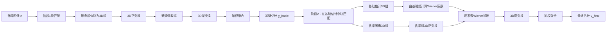

# BM3D 论文详细分析：基于稀疏三维变换域协同滤波的图像去噪

> 论文：Kostadin Dabov, Alessandro Foi, Vladimir Katkovnik, and Karen Egiazarian, **Image Denoising by Sparse 3-D Transform-Domain Collaborative Filtering**, *IEEE Transactions on Image Processing*, 16(8), 2007, pp. 2080-2095.  
> 分析对象：[13_BM3D_Collaborative_Filtering_Denoising.pdf](./13_BM3D_Collaborative_Filtering_Denoising.pdf)

## 1. 论文结论概览

BM3D（Block-Matching and 3D filtering）的核心思想是：**先在整幅图像中寻找与当前参考块相似的二维图像块，把这些块堆叠成三维组；再对三维组进行稀疏变换和系数收缩；最后把滤波后的块放回原位置并加权融合。**

算法包含两个连续阶段：

1. **基础估计阶段**：块匹配、三维变换、硬阈值收缩、逆变换和加权聚合，得到基础估计 $\hat y^{\mathrm{basic}}$。
2. **最终估计阶段**：在基础估计上重新进行更可靠的块匹配，以基础估计作为导频信号构造经验 Wiener 系数，对原始含噪数据进行协同 Wiener 滤波，得到最终估计 $\hat y^{\mathrm{final}}$。

需要特别说明：**BM3D 不是神经网络。**它没有卷积层、可学习权重、损失函数、训练集、反向传播或参数更新。本文所说的“架构”是确定性的信号处理计算架构；所谓“训练流程”应理解为参数预设与推理流程，而不是机器学习训练。

---

## 2. 符号与数据结构

| 符号 | 含义 |
|---|---|
| $X\subset\mathbb Z^2$ | 图像像素坐标集合 |
| $x$ | 二维像素坐标 |
| $y(x)$ | 未知的无噪图像 |
| $z(x)$ | 已知的含噪观测图像 |
| $\eta(x)$ | 加性白高斯噪声 |
| $\sigma$ | 噪声标准差 |
| $Z_x$ | 从含噪图像 $z$ 中、以 $x$ 为左上角截取的二维块 |
| $Y_x$ | 从真实图像 $y$ 中截取的二维块，仅用于理论分析 |
| $\hat Y_x^{\mathrm{basic}}$ | 从基础估计中截取的二维块 |
| $x_R$ | 当前参考块的左上角坐标 |
| $N_1$ | 二维块的边长，块大小为 $N_1\times N_1$ |
| $S_{x_R}$ | 与参考块匹配的图像块坐标集合 |
| $|S_{x_R}|$ | 三维组中包含的二维块数量 |
| $N_2$ | 每组三维数据允许包含的最大块数 |
| $\mathbf Z_{S_{x_R}}$ | 将 $S_{x_R}$ 中的二维块堆叠得到的三维数组 |
| $\mathcal T_{2D}$ | 块内二维变换 |
| $\mathcal T_{1D}$ | 沿组内块序列方向的一维变换 |
| $\mathcal T_{3D}$ | 对整个三维组执行的可分离三维变换 |
| “ht” | 第一阶段 hard-thresholding，即硬阈值滤波 |
| “wie” | 第二阶段 Wiener filtering，即 Wiener 滤波 |

第一、第二阶段可能采用不同的块大小、匹配阈值和组大小，因此论文分别使用上标 $\mathrm{ht}$ 与 $\mathrm{wie}$ 区分参数。

---

## 3. 核心原理

### 3.1 图像的非局部自相似性

自然图像中的边缘、纹理、平坦区域和缓慢变化区域经常在不同空间位置重复出现。因此，以某个图像块为参考，通常能够在其邻域甚至整幅图像中找到若干结构相似的块。

BM3D 不把每个块独立处理，而是让相似块共同参与估计。这种机制称为**协同滤波**：组内每一个块都为其他块的去噪提供信息，而每个块也从整个组的共同结构中受益。

### 3.2 从二维块到三维组

设参考块为 $Z_{x_R}$，通过块匹配得到坐标集合 $S_{x_R}$。把匹配块按一定顺序堆叠：

$$
\mathbf Z_{S_{x_R}}
=
\operatorname{stack}\{Z_x:x\in S_{x_R}\}.
$$

若二维块大小为 $N_1\times N_1$，组内块数为 $|S_{x_R}|$，则三维组的尺寸为

$$
N_1\times N_1\times |S_{x_R}|.
$$

前两个维度描述每个块内部的空间结构，第三个维度描述相似块之间的变化。

### 3.3 三维变换为何比独立二维变换更稀疏

三维变换通常采用可分离形式：

$$
\mathcal T_{3D}
=
\mathcal T_{1D}^{(\mathrm{group})}
\circ
\mathcal T_{2D}^{(\mathrm{block})}.
$$

具体过程为：

1. 对组内每一个二维块执行相同的二维变换，提取块内空间频率或尺度特征；
2. 对不同块在相同二维频率位置上的系数，沿第三维执行一维变换。

组内块彼此相似，因此它们对应的二维变换系数也高度相关。第三维变换会把共同成分集中到少量低频或 DC 系数，把块间差异放入少数其他系数，从而增强稀疏性。

如果独立处理 $n$ 个相似块，每个块约需 $\alpha$ 个显著二维系数，总计约为 $n\alpha$ 个；经过第三维变换后，共同结构可能只需约 $\alpha$ 个主系数表示。这不是严格恒等式，而是论文用于解释稀疏性增强的定性分析。

### 3.4 协同滤波的统一形式

三维变换域协同滤波包括三步：

1. 三维正变换：$\mathbf C=\mathcal T_{3D}(\mathbf Z)$；
2. 对系数执行收缩：$\widetilde{\mathbf C}=\mathcal S(\mathbf C)$；
3. 三维逆变换：$\widehat{\mathbf Y}=\mathcal T_{3D}^{-1}(\widetilde{\mathbf C})$。

其中第一阶段的 $\mathcal S$ 是硬阈值算子，第二阶段的 $\mathcal S$ 是由基础估计控制的经验 Wiener 收缩。

---

## 4. 总体算法架构



阶段 1 的作用是生成可靠但相对保守的导频图像；阶段 2 利用导频图像改进匹配，并对原始含噪数据执行更精细的 Wiener 去噪。第二阶段并不是简单地再次滤波第一阶段输出，而是**用基础估计指导对原始观测数据的滤波**。

---

## 5. 观测模型

论文假设输入满足加性白高斯噪声模型：

$$
z(x)=y(x)+\eta(x),\qquad x\in X,
$$

$$
\eta(x)\overset{\mathrm{i.i.d.}}{\sim}\mathcal N(0,\sigma^2).
$$

含义如下：

- $y(x)$ 是需要恢复的真实像素；
- $z(x)$ 是算法实际观测到的像素；
- $\eta(x)$ 在各像素之间独立同分布；
- 噪声均值为 0，方差为 $\sigma^2$；
- 原始 BM3D 要求已知或预先估计 $\sigma$，因为匹配预滤波阈值、三维硬阈值和 Wiener 系数都依赖它。

---

## 6. 第一阶段：基础估计

### 6.1 逐参考块扫描

在图像上按步长 $N_{\mathrm{step}}^{\mathrm{ht}}$ 选取参考位置 $x_R$。对每一个参考块 $Z_{x_R}$，执行块匹配、三维硬阈值协同滤波，并把所有滤波块放回原坐标。不同参考组产生的块估计会大量重叠，最后统一聚合。

### 6.2 理想块距离：公式（1）

如果真实无噪图像 $y$ 已知，可用归一化平方欧氏距离判断两个块是否相似：

$$
d^{\mathrm{ideal}}(Z_{x_R},Z_x)
=
\frac{\|Y_{x_R}-Y_x\|_2^2}{(N_1^{\mathrm{ht}})^2}.
\tag{1}
$$

其中

$$
\|Y_{x_R}-Y_x\|_2^2
=
\sum_{i=1}^{N_1^{\mathrm{ht}}}
\sum_{j=1}^{N_1^{\mathrm{ht}}}
\left(Y_{x_R}(i,j)-Y_x(i,j)\right)^2.
$$

除以块内像素数 $(N_1^{\mathrm{ht}})^2$ 后，距离变成平均平方差，因而不同块尺寸下更容易统一解释。距离越小，两个块越相似。

### 6.3 直接在含噪块上计算的距离：公式（2）

真实图像不可见，最直接的替代量是

$$
d^{\mathrm{noisy}}(Z_{x_R},Z_x)
=
\frac{\|Z_{x_R}-Z_x\|_2^2}{(N_1^{\mathrm{ht}})^2}.
\tag{2}
$$

写成噪声与信号之和：

$$
Z_{x_R}-Z_x
=
(Y_{x_R}-Y_x)+(\eta_{x_R}-\eta_x).
$$

因此，即使两个真实块完全相同，两个独立噪声块之差仍会使距离大于零。

### 6.4 含噪距离的期望和方差：公式（3）

当两个块互不重叠时，$d^{\mathrm{noisy}}$ 是非中心卡方随机变量的缩放形式。论文给出

$$
\mathbb E\left\{d^{\mathrm{noisy}}(Z_{x_R},Z_x)\right\}
=
d^{\mathrm{ideal}}(Z_{x_R},Z_x)+2\sigma^2,
\tag{3a}
$$

$$
\operatorname{var}\left\{d^{\mathrm{noisy}}(Z_{x_R},Z_x)\right\}
=
\frac{8\sigma^4}{(N_1^{\mathrm{ht}})^2}+ \frac{8\sigma^2d^{\mathrm{ideal}}(Z_{x_R},Z_x)}{(N_1^{\mathrm{ht}})^2}.
\tag{3b}
$$

第一项 $2\sigma^2$ 表示两块噪声差带来的距离偏移；方差中的 $\sigma^4$ 项说明噪声较大时，距离测量会快速变得不稳定。其后果是：真正相似的块可能被漏掉，而不相似的块可能被错误纳入同一组。

### 6.5 预滤波块距离：公式（4）

为提高高噪声下的匹配可靠性，论文先对每个候选块进行二维变换和粗硬阈值预滤波，再比较变换域系数：

$$
d(Z_{x_R},Z_x)
=
\frac{
\left\|
\gamma'\!\left(\mathcal T_{2D}^{\mathrm{ht}}(Z_{x_R})\right)-
\gamma'\!\left(\mathcal T_{2D}^{\mathrm{ht}}(Z_x)\right)
\right\|_2^2
}{(N_1^{\mathrm{ht}})^2}.
\tag{4}
$$

$\gamma'$ 是阈值为 $\lambda_{2D}\sigma$ 的硬阈值算子：

$$
\gamma'(c)=
\begin{cases}
c, & |c|>\lambda_{2D}\sigma,\\
0, & |c|\leq\lambda_{2D}\sigma.
\end{cases}
$$

解释：

- $\mathcal T_{2D}^{\mathrm{ht}}$ 将块转换到稀疏频率或尺度域；
- 小幅系数更可能由噪声造成，预先置零可减少噪声对匹配的干扰；
- 这里的预滤波只用于计算距离，不是最终的块估计；
- 当 $\mathcal T_{2D}^{\mathrm{ht}}$ 为正交变换时，可直接在变换域计算距离，无须显式逆变换。

论文的 Normal Profile 在 $\sigma\leq40$ 时设 $\lambda_{2D}=0$，即不启用预滤波；在 $\sigma>40$ 时设 $\lambda_{2D}=2$。

### 6.6 匹配集合：公式（5）

匹配块坐标集合定义为

$$
S_{x_R}^{\mathrm{ht}}
=
\left\{
x\in X:
d(Z_{x_R},Z_x)\leq\tau_{\mathrm{match}}^{\mathrm{ht}}
\right\}.
\tag{5}
$$

其中 $\tau_{\mathrm{match}}^{\mathrm{ht}}$ 是相似性阈值。实现中通常还会：

- 只在以 $x_R$ 为中心的 $N_S^{\mathrm{ht}}\times N_S^{\mathrm{ht}}$ 搜索窗口内比较；
- 按距离从小到大排序；
- 最多保留 $N_2^{\mathrm{ht}}$ 个块；
- 始终保留参考块本身，因为 $d(Z_{x_R},Z_{x_R})=0$；
- 为适配 Haar 第三维变换，将组内块数截成不超过候选数的最大 2 的幂。

### 6.7 构造三维组

将所有匹配的含噪块堆叠成

$$
\mathbf Z_{S_{x_R}^{\mathrm{ht}}}
=
\operatorname{stack}
\left\{Z_x:x\in S_{x_R}^{\mathrm{ht}}\right\}.
$$

其尺寸为

$$
N_1^{\mathrm{ht}}
\times N_1^{\mathrm{ht}}
\times |S_{x_R}^{\mathrm{ht}}|.
$$

匹配块可以重叠，不同参考块形成的组也可以彼此重叠。BM3D 并不要求把整幅图像分割成互斥类别。

### 6.8 三维硬阈值协同滤波：公式（6）

第一阶段的组估计为

$$
\widehat{\mathbf Y}_{S_{x_R}^{\mathrm{ht}}}^{\mathrm{ht}}
=
\left(\mathcal T_{3D}^{\mathrm{ht}}\right)^{-1}
\left[
\gamma\!\left(
\mathcal T_{3D}^{\mathrm{ht}}
\left(\mathbf Z_{S_{x_R}^{\mathrm{ht}}}\right)
\right)
\right].
\tag{6}
$$

$\gamma$ 是阈值为 $\lambda_{3D}\sigma$ 的硬阈值算子：

$$
\gamma(c)=
\begin{cases}
c, & |c|>\lambda_{3D}\sigma,\\
0, & |c|\leq\lambda_{3D}\sigma.
\end{cases}
$$

逐步解释：

1. **二维块内变换**：对每个匹配块执行 $\mathcal T_{2D}^{\mathrm{ht}}$；
2. **第三维变换**：沿相似块序列执行 $\mathcal T_{1D}$；
3. **硬阈值收缩**：删除绝对值小于阈值的三维变换系数；
4. **第三维逆变换**：恢复每个块的二维变换谱；
5. **二维逆变换**：得到所有组内块的空间域估计。

若变换已归一化，白噪声经过正交变换后仍具有标准差 $\sigma$，因此可以用 $\lambda_{3D}\sigma$ 作为统一阈值。论文 Normal Profile 使用 $\lambda_{3D}=2.7$（$\sigma\leq40$）或 $2.8$（$\sigma>40$）。

### 6.9 第一阶段组权重：公式（10）

设 $N_{\mathrm{har}}^{x_R}$ 是公式（6）中硬阈值后保留的非零三维系数数量。第一阶段聚合权重定义为

$$
w_{x_R}^{\mathrm{ht}}
=
\begin{cases}
\dfrac{1}{\sigma^2N_{\mathrm{har}}^{x_R}},
& N_{\mathrm{har}}^{x_R}\geq1,\\[6pt]
1, & \text{其他情况}.
\end{cases}
\tag{10}
$$

保留系数越多，通常意味着组结构越复杂、残余噪声总方差越大，因此权重越小。反之，更稀疏、估计方差更低的组获得更高权重。

实际实现还会把一个 $N_1\times N_1$ 的 Kaiser 窗乘入每个块的空间权重，以降低 DCT、DFT 或周期化小波变换导致的块边界效应。

### 6.10 第一阶段加权聚合：公式（12）

一个像素可能被多个参考组、多个组内块重复估计。设 $\chi_{x_m}(x)$ 是位于 $x_m$ 的块支持域指示函数：当像素 $x$ 位于该块内时取 1，否则取 0。基础估计为

$$
\hat y^{\mathrm{basic}}(x)
=
\frac{
\displaystyle
\sum_{x_R\in X}
\sum_{x_m\in S_{x_R}^{\mathrm{ht}}}
w_{x_R}^{\mathrm{ht}}
\widehat Y_{x_m}^{\mathrm{ht},x_R}(x)
}{
\displaystyle
\sum_{x_R\in X}
\sum_{x_m\in S_{x_R}^{\mathrm{ht}}}
w_{x_R}^{\mathrm{ht}}\chi_{x_m}(x)
},
\qquad x\in X.
\tag{12}
$$

分子累加所有覆盖像素 $x$ 的加权块估计，分母累加相同位置的权重。两者相除得到归一化的全局像素估计。

实现时不必保存所有块：使用两个与图像同尺寸的缓冲区，一个累加“权重乘估计值”，另一个累加权重，处理完全部参考组后逐像素相除即可。

---

## 7. 第二阶段：基础估计引导的协同 Wiener 滤波

### 7.1 为什么需要第二阶段

第一阶段使用硬阈值做二元决策：系数要么完全保留，要么完全删除。这种估计稳健，但较粗糙。得到 $\hat y^{\mathrm{basic}}$ 后，可以利用它完成两件事：

1. 在噪声已显著减弱的基础估计中计算块距离，使相似块分组更准确；
2. 用基础估计的三维变换能量估计真实信号能量，构造连续的 Wiener 收缩系数。

### 7.2 第二阶段匹配集合：公式（7）

在基础估计中使用普通归一化平方距离：

$$
S_{x_R}^{\mathrm{wie}}
=
\left\{
x\in X:
\frac{
\left\|
\widehat Y_{x_R}^{\mathrm{basic}}-
\widehat Y_x^{\mathrm{basic}}
\right\|_2^2
}{(N_1^{\mathrm{wie}})^2}
<
\tau_{\mathrm{match}}^{\mathrm{wie}}
\right\}.
\tag{7}
$$

基础估计中的噪声已被压制，所以该距离更接近公式（1）的理想距离，不再需要公式（4）的粗预滤波。

### 7.3 在相同坐标上构造两个三维组

根据同一坐标集合 $S_{x_R}^{\mathrm{wie}}$，构造：

$$
\widehat{\mathbf Y}_{S_{x_R}^{\mathrm{wie}}}^{\mathrm{basic}}
=
\operatorname{stack}
\left\{
\widehat Y_x^{\mathrm{basic}}:
x\in S_{x_R}^{\mathrm{wie}}
\right\},
$$

$$
\mathbf Z_{S_{x_R}^{\mathrm{wie}}}
=
\operatorname{stack}
\left\{
Z_x:
x\in S_{x_R}^{\mathrm{wie}}
\right\}.
$$

第一个组提供较干净的信号能量估计，第二个组保留原始观测信息。两组的块位置和排列顺序必须完全一致，这样每个 Wiener 系数才能对应同一空间频率和同一组间频率。

### 7.4 经验 Wiener 系数：公式（8）

先对基础估计组做三维变换。论文按元素定义 Wiener 系数数组：

$$
\mathbf W_{S_{x_R}^{\mathrm{wie}}}
=
\frac{
\left|
\mathcal T_{3D}^{\mathrm{wie}}
\left(
\widehat{\mathbf Y}_{S_{x_R}^{\mathrm{wie}}}^{\mathrm{basic}}
\right)
\right|^2
}{
\left|
\mathcal T_{3D}^{\mathrm{wie}}
\left(
\widehat{\mathbf Y}_{S_{x_R}^{\mathrm{wie}}}^{\mathrm{basic}}
\right)
\right|^2
+\sigma^2
}.
\tag{8}
$$

上式的除法、绝对值和平方均为逐元素运算。对任一三维变换系数 $k$，令基础估计提供的幅度为 $b_k$，则

$$
W_k=\frac{|b_k|^2}{|b_k|^2+\sigma^2}.
$$

- 若 $|b_k|^2\gg\sigma^2$，则 $W_k\approx1$，认为该频率主要是信号，基本保留；
- 若 $|b_k|^2\ll\sigma^2$，则 $W_k\approx0$，认为该频率主要是噪声，强烈衰减；
- $W_k\in[0,1]$，因此比硬阈值的 0/1 决策更平滑。

这里使用的是**经验 Wiener 滤波**：真实信号功率谱未知，算法用基础估计组的三维变换能量代替它。

### 7.5 协同 Wiener 滤波：公式（9）

将 Wiener 系数逐元素乘到原始含噪组的三维变换系数上，再做逆变换：

$$
\widehat{\mathbf Y}_{S_{x_R}^{\mathrm{wie}}}^{\mathrm{wie}}
=
\left(\mathcal T_{3D}^{\mathrm{wie}}\right)^{-1}
\left[
\mathbf W_{S_{x_R}^{\mathrm{wie}}}
\odot
\mathcal T_{3D}^{\mathrm{wie}}
\left(
\mathbf Z_{S_{x_R}^{\mathrm{wie}}}
\right)
\right].
\tag{9}
$$

$\odot$ 表示逐元素乘法。注意滤波对象是原始含噪组 $\mathbf Z$，而不是基础估计组；基础估计只用来确定收缩强度。这样既利用了基础估计的结构先验，又避免把第一阶段已经丢失的信息永久锁死。

### 7.6 第二阶段组权重：公式（11）

第二阶段聚合权重为

$$
w_{x_R}^{\mathrm{wie}}
=
\sigma^{-2}
\left\|
\mathbf W_{S_{x_R}^{\mathrm{wie}}}
\right\|_2^{-2}.
\tag{11}
$$

即

$$
w_{x_R}^{\mathrm{wie}}
=
\frac{1}{
\sigma^2
\sum_k W_k^2
}.
$$

$\sum_kW_k^2$ 反映该组滤波后保留的总噪声能量比例。保留强度越大，残余噪声方差通常越高，因而聚合权重越小。

严格来说，重叠块中的噪声并不完全独立，精确方差还应包含协方差项。论文为保持计算效率忽略了这些协方差，因此公式（10）和（11）是与真实总方差大致成反比的实用权重。

### 7.7 最终加权聚合

最终估计仍采用公式（12）的形式，但作如下替换：

$$
\hat y^{\mathrm{basic}}
ightarrow\hat y^{\mathrm{final}},
\quad
S_{x_R}^{\mathrm{ht}}
ightarrow S_{x_R}^{\mathrm{wie}},
\quad
w_{x_R}^{\mathrm{ht}}
ightarrow w_{x_R}^{\mathrm{wie}},
$$

$$
\widehat Y_{x_m}^{\mathrm{ht},x_R}
\rightarrow
\widehat Y_{x_m}^{\mathrm{wie},x_R}.
$$

因此

$$
\hat y^{\mathrm{final}}(x)
=
\frac{
\displaystyle
\sum_{x_R\in X}
\sum_{x_m\in S_{x_R}^{\mathrm{wie}}}
w_{x_R}^{\mathrm{wie}}
\widehat Y_{x_m}^{\mathrm{wie},x_R}(x)
}{
\displaystyle
\sum_{x_R\in X}
\sum_{x_m\in S_{x_R}^{\mathrm{wie}}}
w_{x_R}^{\mathrm{wie}}
\chi_{x_m}(x)
}.
$$

---

## 8. 完整算法流程

### 8.1 阶段 1 伪代码

```text
输入：含噪图像 z、噪声标准差 σ
初始化：numerator_ht = 0，denominator_ht = 0

for 每个第一阶段参考位置 x_R:
    1. 取参考块 Z_xR
    2. 在搜索窗口内计算公式（4）的块距离
    3. 根据公式（5）筛选、排序并截断匹配块
    4. 将匹配块堆叠为三维组 Z_Sht
    5. 对 Z_Sht 执行三维正变换
    6. 以 λ_3D σ 对三维系数硬阈值化
    7. 执行三维逆变换，得到全部组内块估计
    8. 根据公式（10）计算组权重
    9. 将组内块乘以组权重和 Kaiser 窗后累加到 numerator_ht
   10. 将相应权重累加到 denominator_ht

y_basic = numerator_ht / denominator_ht
```

### 8.2 阶段 2 伪代码

```text
输入：含噪图像 z、基础估计 y_basic、噪声标准差 σ
初始化：numerator_wie = 0，denominator_wie = 0

for 每个第二阶段参考位置 x_R:
    1. 在 y_basic 中计算公式（7）的块距离
    2. 筛选、排序并截断匹配坐标集合 S_wie
    3. 按相同坐标分别从 y_basic 与 z 构造两个三维组
    4. 对基础估计组执行三维正变换
    5. 根据公式（8）逐系数计算 Wiener 收缩系数
    6. 对含噪组执行三维正变换
    7. 将 Wiener 系数逐元素乘到含噪组变换系数上
    8. 执行三维逆变换，得到全部组内块估计
    9. 根据公式（11）计算组权重
   10. 将组内块乘以组权重和 Kaiser 窗后累加到 numerator_wie
   11. 将相应权重累加到 denominator_wie

y_final = numerator_wie / denominator_wie
输出：y_final
```

---

## 9. “网络架构”和训练流程分析

### 9.1 计算架构

BM3D 可以被写成由确定性模块组成的计算图：

| 模块 | 输入 | 运算 | 输出 |
|---|---|---|---|
| 噪声模型模块 | $z,\sigma$ | 提供噪声强度 | 各阈值和 Wiener 分母中的 $\sigma$ |
| 参考块扫描 | 图像、步长 | 选取 $x_R$ | 参考块序列 |
| 块匹配 | 参考块、候选块 | 距离计算、排序、阈值和截断 | 匹配坐标集合 |
| 三维组装 | 图像、匹配坐标 | 堆叠二维块 | 三维组 |
| 三维变换 | 三维组 | 2D 块内变换 + 1D 组间变换 | 稀疏系数 |
| 收缩模块 | 系数、$\sigma$、导频组 | 硬阈值或 Wiener 增益 | 去噪系数 |
| 三维逆变换 | 去噪系数 | 1D 逆变换 + 2D 逆变换 | 多个块估计 |
| 聚合模块 | 重叠块估计、组权重 | 加权累加与归一化 | 全图估计 |

### 9.2 不存在机器学习训练

原始 BM3D 的参数包括：

- 块大小 $N_1$；
- 组内最大块数 $N_2$；
- 参考块步长 $N_{\mathrm{step}}$；
- 搜索窗口大小 $N_S$；
- 匹配阈值 $\tau_{\mathrm{match}}$；
- 二维预滤波阈值系数 $\lambda_{2D}$；
- 三维硬阈值系数 $\lambda_{3D}$；
- Kaiser 窗参数 $\beta$；
- 固定的二维和一维变换类型。

这些参数由作者通过理论考虑和实验比较设定为 Fast/Normal Profile，而不是通过梯度下降从训练集学习。因此它的“训练流程”为：

```text
人工选择变换和参数范围
        ↓
在标准测试图像及多个噪声水平上比较 PSNR/视觉质量/速度
        ↓
固定为 Fast Profile 或 Normal Profile
        ↓
对新图像直接运行两阶段推理
```

推理阶段也不会修改任何参数。输入变化只会改变匹配到的块、三维组、变换系数、Wiener 增益和最终聚合结果。

---

## 10. 原论文 Normal Profile 参数

### 10.1 第一阶段参数

| 参数 | $\sigma\leq40$ | $\sigma>40$ | 作用 |
|---|---:|---:|---|
| $\mathcal T_{2D}^{\mathrm{ht}}$ | 2D Bior1.5 | 2D DCT | 块内二维变换 |
| $N_1^{\mathrm{ht}}$ | 8 | 12 | 块边长 |
| $N_2^{\mathrm{ht}}$ | 16 | 16 | 最大组内块数 |
| $N_{\mathrm{step}}^{\mathrm{ht}}$ | 3 | 4 | 参考块扫描步长 |
| $N_S^{\mathrm{ht}}$ | 39 | 39 | 搜索窗口边长 |
| $N_{FS}^{\mathrm{ht}}$ | 1 | 1 | 每次均作穷举搜索 |
| $\beta^{\mathrm{ht}}$ | 2.0 | 2.0 | Kaiser 窗参数 |
| $\lambda_{2D}$ | 0 | 2.0 | 匹配预滤波阈值系数 |
| $\lambda_{3D}$ | 2.7 | 2.8 | 三维硬阈值系数 |
| $\tau_{\mathrm{match}}^{\mathrm{ht}}$ | 2500 | 5000 | 第一阶段匹配阈值 |

### 10.2 第二阶段参数

| 参数 | $\sigma\leq40$ | $\sigma>40$ | 作用 |
|---|---:|---:|---|
| $\mathcal T_{2D}^{\mathrm{wie}}$ | 2D DCT | 2D DCT | 块内二维变换 |
| $N_1^{\mathrm{wie}}$ | 8 | 11 | 块边长 |
| $N_2^{\mathrm{wie}}$ | 32 | 32 | 最大组内块数 |
| $N_{\mathrm{step}}^{\mathrm{wie}}$ | 3 | 6 | 参考块扫描步长 |
| $N_S^{\mathrm{wie}}$ | 39 | 39 | 搜索窗口边长 |
| $N_{FS}^{\mathrm{wie}}$ | 1 | 1 | 每次均作穷举搜索 |
| $\tau_{\mathrm{match}}^{\mathrm{wie}}$ | 400 | 3500 | 第二阶段匹配阈值 |
| $\beta^{\mathrm{wie}}$ | 2.0 | 2.0 | Kaiser 窗参数 |

两阶段共同使用 1D Haar 变换作为第三维变换 $\mathcal T_{1D}$。

参数并非对任意数据范围都能原样照搬。表中阈值以论文的 8-bit 图像强度范围 $[0,255]$ 为背景；若实现把图像归一化到 $[0,1]$，则 $\sigma$ 和距离阈值必须按相同尺度换算。

---

## 11. 快速实现与复杂度

### 11.1 减少参考块数量

不对每一个像素都选参考块，而以 $N_{\mathrm{step}}$ 为水平和垂直步长。参考块数量由约 $|X|$ 降到约

$$
\frac{|X|}{N_{\mathrm{step}}^2}.
$$

### 11.2 降低块匹配开销

- 限制搜索窗口为 $N_S\times N_S$；
- 限制组大小不超过 $N_2$；
- Fast Profile 使用预测搜索：根据前一参考块的匹配位置预测当前搜索区域；
- 每隔 $N_{FS}$ 个参考块仍执行一次较大窗口的穷举搜索，防止预测累积偏差。

### 11.3 复用二维变换

对搜索窗口内所有滑动块预先计算二维变换谱并缓存。后续多个重叠参考窗口可复用这些结果。三维正变换只需在已缓存二维谱上沿第三维执行 $\mathcal T_{1D}$。

### 11.4 高效聚合

使用两个图像大小的缓冲区：

$$
B_{\mathrm{num}}(x)
\leftarrow
B_{\mathrm{num}}(x)+w\widehat Y(x),
$$

$$
B_{\mathrm{den}}(x)
\leftarrow
B_{\mathrm{den}}(x)+w,
$$

最后计算

$$
\hat y(x)=\frac{B_{\mathrm{num}}(x)}{B_{\mathrm{den}}(x)}.
$$

### 11.5 论文给出的每像素运算量近似

在忽略 “ht” 和 “wie” 上标，并不使用预测搜索时，论文给出的每像素运算量近似为

$$
3\mathcal C_{\mathcal T_{2D}}+
\frac{2(N_1^2+N_2)N_S^2}{N_{\mathrm{step}}^2}+
\frac{3\left(N_2\mathcal C_{\mathcal T_{2D}}
+N_1^2\mathcal C_{\mathcal T_{1D}}\right)}{N_{\mathrm{step}}^2}.
$$

其中 $\mathcal C_{\mathcal T}$ 表示一次变换 $\mathcal T$ 所需的算术运算数：

- 第一项来自为滑动块预计算二维变换；
- 第二项来自 $N_S\times N_S$ 邻域中的穷举块匹配；
- 第三项来自二维与第三维变换组成的三维协同滤波。

当参数固定时，每个像素的工作量近似固定，因此总时间复杂度相对于图像像素数 $|X|$ 为

$$
\mathcal O(|X|).
$$

这并不表示常数很小；块匹配通常仍是主要计算瓶颈。

---

## 12. 彩色扩展 C-BM3D：公式（13）

论文先将 RGB 转换到亮度-色度空间，再只在亮度通道上执行块匹配。两种候选变换矩阵为

$$
A_{YCbCr}
=
\begin{bmatrix}
0.30 & 0.59 & 0.11\\
-0.17 & -0.33 & 0.50\\
0.50 & -0.42 & -0.08
\end{bmatrix},
$$

$$
A_{\mathrm{opp}}
=
\begin{bmatrix}
\frac13 & \frac13 & \frac13\\[4pt]
\frac1{\sqrt6} & 0 & -\frac1{\sqrt6}\\[4pt]
\frac1{3\sqrt2} & -\frac{\sqrt2}{3} & \frac1{3\sqrt2}
\end{bmatrix}.
\tag{13}
$$

若 $\mathbf c_{RGB}=[R,G,B]^T$，则

$$
\mathbf c_{YUV}=A\mathbf c_{RGB}.
$$

亮度 $Y$ 通常具有更高信噪比，并承载主要边缘、物体轮廓和纹理信息。因此 C-BM3D：

1. 只在 $Y$ 通道上计算公式（5）和（7）的匹配坐标；
2. 在 $Y$、$U$、$V$ 三个通道复用同一组坐标；
3. 各通道分别进行三维协同滤波和聚合；
4. 最后逆颜色变换回 RGB。

复用亮度分组不仅避免低信噪比色度通道产生错误匹配，还比对三个通道分别执行完整 BM3D 节省约三分之一的计算量。

---

## 13. 评价指标

对于 8-bit 灰度图像，论文使用

$$
\operatorname{PSNR}(\hat y)
=
10\log_{10}
\left(
\frac{255^2}{
|X|^{-1}\sum_{x\in X}(y(x)-\hat y(x))^2
}
\right).
$$

对于 RGB 图像，三个通道共同计算均方误差：

$$
\operatorname{PSNR}_{RGB}
=
10\log_{10}
\left(
\frac{255^2}{
(3|X|)^{-1}
\sum_{c\in\{R,G,B\}}
\sum_{x\in X}
(y_c(x)-\hat y_c(x))^2
}
\right).
$$

PSNR 越高表示平均平方误差越小，但它不能完全代替视觉质量评价。论文同时强调平坦区域、平滑过渡、纹理、重复结构、尖锐边缘和伪影数量等主观表现。

---

## 14. 为什么 BM3D 有效

### 14.1 分组是数据自适应的表示机制

BM3D 的变换本身是固定的，但每个参考块匹配到哪些块由输入图像决定。因此，**自适应性主要来自分组，而不是来自学习变换字典。**不同纹理、边缘和结构会形成不同三维组，相当于为每个局部结构构造一个非局部支持域。

### 14.2 同时利用两类相关性

- **块内相关性**：自然图像相邻像素及局部结构之间存在相关性，由二维变换利用；
- **块间相关性**：不同位置的相似块之间存在相关性，由第三维变换利用。

这两类相关性共同产生比独立二维变换更稀疏的表示。

### 14.3 “硬阈值 + Wiener”形成粗到细估计

硬阈值阶段偏向稳健地删除明显噪声，形成导频图；Wiener 阶段使用导频图对每个频率分量进行连续强度估计。两阶段组合兼顾结构发现和精细恢复。

### 14.4 重叠聚合抑制块效应

每个像素由许多块、许多参考组反复估计。加权平均降低单个组的误差与块边界伪影，也形成一种过完备表示带来的方差缩减。

### 14.5 第三维变换的 DC 分量很重要

相似块在第三维上具有较强共同成分，含 DC 基函数的 Haar 等变换能直接捕捉这种相似性。论文实验表明，仅保留 DC 的简单平均仍不够，因为实际匹配块并非完全相同；还需要其他第三维基函数表达块间差异。

---

## 15. 局限性与适用边界

1. **依赖噪声模型**：原论文针对独立同分布的加性白高斯噪声。泊松噪声、条纹噪声、空间相关噪声或未知真实相机噪声需要噪声稳定化、预白化或改进版本。
2. **依赖噪声标准差**：$\sigma$ 估计错误会同时影响匹配、硬阈值和 Wiener 收缩。
3. **高噪声下分组困难**：当图像结构被噪声严重淹没时，即使预滤波也可能找错相似块。
4. **重复纹理可能产生错误对应**：外观相近但语义或细节不同的块可能被放入同一组，引起纹理平均或幽灵结构。
5. **计算与内存开销较高**：大量滑窗搜索、距离排序、三维变换和重叠聚合比普通局部滤波复杂。
6. **极少重复结构时优势下降**：若图像中难以找到真正相似的非局部块，第三维稀疏增益会减弱。
7. **固定参数与动态范围相关**：论文参数基于特定噪声模型和 $[0,255]$ 强度范围，移植时需换算。
8. **不是端到端可训练模型**：它不能像现代深度网络那样通过任务数据自动适应特定传感器、退化模型或感知损失；但其可解释性和无需训练也是重要优点。

---

## 16. 最终总结

BM3D 可以概括为以下闭环：

$$
\text{非局部相似块搜索}
\rightarrow
\text{三维组装}
\rightarrow
\text{稀疏三维变换}
\rightarrow
\text{系数收缩}
\rightarrow
\text{逆变换}
\rightarrow
\text{重叠加权聚合}.
$$

第一阶段通过硬阈值获得 $\hat y^{\mathrm{basic}}$，第二阶段用它改进分组并估计 Wiener 增益，再回到原始含噪观测中完成精细恢复。BM3D 的关键贡献不是某一种单独的阈值函数，而是把**非局部自相似、三维稀疏表示、协同滤波、导频估计和冗余聚合**组织成一个统一的两阶段框架。

---

## 参考文献

[1] K. Dabov, A. Foi, V. Katkovnik, and K. Egiazarian, “Image Denoising by Sparse 3-D Transform-Domain Collaborative Filtering,” *IEEE Transactions on Image Processing*, vol. 16, no. 8, pp. 2080-2095, Aug. 2007. DOI: 10.1109/TIP.2007.901238.  
简要说明：BM3D 的正式完整论文，系统提出分组、三维硬阈值协同滤波、基础估计引导的经验 Wiener 滤波、加权聚合、快速实现和彩色扩展 C-BM3D。
